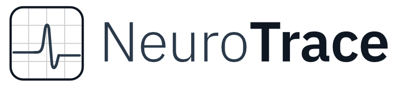

# NeuroTrace

A modern electrophysiology analysis desktop app inspired by [Stimfit](https://github.com/neurodroid/stimfit). Electron shell + React/TypeScript/Vite frontend + Python FastAPI backend. All numerical work lives in Python; the frontend renders and handles interaction.

Current release: **v0.6.1**. macOS Apple-Silicon DMG and Windows NSIS installers are built automatically by GitHub Actions on each tag — see the [releases page](https://github.com/marcoledri/neurotrace/releases).



## What it does

Open a recording, navigate the group → series → sweep tree, and run analysis modules over the trace. Each module has its own window with a continuous-mode viewer + draggable cursor regions, a parameter sidebar, and a results table you can curate. Detection results are kept in a sidecar JSON (`recording.dat.neurotrace`) next to the recording, so reopening the file restores everything — selections, cursors, every module's last run.

## Analysis modules

**Single-cell**

- **Cursor measurements** — baseline / peak / amplitude / rise / decay / half-width / area, with up to 10 user-configurable measurement slots per recording.
- **Resistance** — Rs / Rin / Cm / τ from test pulses, single-sweep or cross-sweep mode.
- **I-V curve** — steady-state and transient-peak responses to current / voltage steps, sag and reversal-potential extraction.
- **Action Potentials** — full kinetics (threshold, peak, amp, rise / decay slopes, half-width, fAHP, mAHP), per-sweep counting + F-I curve + rheobase, phase plot. Supports interpolation to 200 kHz and 8 threshold methods.
- **Event Detection** — template matching (correlation, deconvolution) and thresholding with biexponential per-event fits, multi-template detection, per-event group / template tagging, manual add / remove. Companion sub-windows for template generation, refinement, and a multi-event browser overlay.
- **Burst Detection (field bursts)** — three detectors (threshold, oscillation envelope, ISI clustering) on continuous extracellular traces, with per-burst kinetics + integrated charge.
- **Field potential** — fEPSP slope, population spike amplitude, paired-pulse ratio (PPR), and LTP / LTD time-courses bundled into one window with mode tabs.
- **Paired recording** — pre / post detection in two-channel recordings, success / failure classification, latency, PPR, spike-triggered average + decay fit.
- **Spectral** — power spectrum + spectrogram (preview).

**Cross-cutting**

- **Train grouping** — optional post-detection clustering of closely-spaced events into trains (`T1, T2, …`) for the AP, Event, and Burst windows. Off by default; toggle one sidebar checkbox to label clusters by max IEI / min count, with shaded amber spans on the trace and a per-train summary table. Same algorithm runs in the cohort extractor.

**Multi-cell / multi-file**

- **Metadata** — file-level and series-level tag editor, bulk consistency checker, group definitions for downstream cohort comparisons.
- **Trace Export** — figure-quality SVG / PNG / PDF / JPG export with template + session save.
- **Batch** — pick a template recording, extract recipes from its tags, run them across a folder of target files; train-grouping params propagate to each target sidecar.
- **Cohort** — aggregate sidecars across a folder, run two-group / N-group / paired / RM-ANOVA stats with post-hocs, render publication-ready dot / bar / box / violin / ECDF / time-series plots, export to CSV / Excel / Prism `.pzfx`.

## File format support

HEKA Patchmaster (`.dat`), Axon Binary Format (`.abf`), and 50+ other formats via [Neo](https://github.com/NeuralEnsemble/python-neo).

## Persistence model

Per-recording state lives in a `.neurotrace` JSON sidecar next to the recording file. The sidecar carries:

- All analysis results (events, bursts, AP, IV, fPSP, paired, cursors, resistance).
- Form / parameter state for each module (so reopening a recording lands you back on the exact same configuration).
- Train-grouping params per module per series.
- Recording metadata (file-level + series-level tags) consumed by the cohort module.
- Excluded / averaged-sweep selections, cursor positions, scale overrides, per-series filter overrides.

Atomic write via Electron IPC; debounced save on every change.

## Architecture

```
NeuroTrace/
├── electron/           # Electron main process + preload (IPC bridge, sidecar I/O)
├── frontend/           # React + TypeScript + Vite UI
│   └── src/
│       ├── components/ # TraceViewer, TreeNavigator, CursorPanel, AnalysisWindows/, Manual/
│       ├── stores/     # Zustand state (app + theme)
│       ├── utils/      # trains.ts, sampleTraceY.ts, rowSelection.ts, ...
│       └── styles/
├── backend/            # Python FastAPI server
│   ├── api/            # REST endpoints (one router per analysis domain)
│   ├── readers/        # HEKA / ABF / Neo file readers
│   ├── analysis/       # Pure-Python analysis modules + cohort extractors
│   └── utils/          # Filtering, LTTB downsampling, baseline subtraction
├── docs/               # Bundled user manual (MANUAL.md, MANUAL_OUTLINE.md)
├── tests/              # TS↔Python parity test for the train-grouping algorithm
└── scripts/            # PyInstaller spec, build helpers, prefs→sidecar migration
```

Electron spawns the FastAPI backend as a child process on a local port (defaults to 8321). The frontend talks to it over HTTP.

## Requirements

- **Node.js** 22.6+ (the train-parity test uses native TS type stripping).
- **Python** 3.10+
- **npm**

## Getting started

```bash
npm install
pip install -r backend/requirements.txt
npm run dev                 # runs Python backend + Electron concurrently
```

Or use the shell helper: `./scripts/dev.sh`.

To verify a build before shipping:

```bash
cd frontend && npx tsc --noEmit && npx vite build
python tests/trains_parity.py
```

## Documentation

The full user manual is bundled into the app (`Help → User Manual`, or open the `manual` analysis window) and lives at `docs/MANUAL.md` for off-line reading. Architectural notes for contributors / agents are in [`CLAUDE.md`](CLAUDE.md) and [`AGENTS.md`](AGENTS.md).

Quick keyboard reference: press `?` inside the app for the shortcuts overlay; the manual's chapter 8 has the full list.

## License

MIT
