# TRACER User Manual

TRACER is a desktop application for analysing electrophysiology
recordings. It reads HEKA `.dat`, Axon `.abf`, and plain-text traces,
and provides interactive tools for measuring passive properties,
synaptic responses, action potentials, spontaneous events, and
field-potential time courses. The interface is built around a
central trace viewer with dedicated windows for each analysis type;
results are stored alongside the recording so a session can be
reopened and resumed exactly where you left off.

This manual is organised into two parts. **Part I** covers the
general application — the workspace, navigation, viewer, and
preferences — and applies to every recording you open. **Part II**
documents each analysis module in turn, with the underlying methods
explained next to the parameters that select them.

---

# Part I — General

## 1. Getting Started

### Launching TRACER

TRACER runs as a single desktop application. When it starts, it
spawns a local Python backend in the background; all numerical work
(filtering, fitting, peak detection, file reading) happens there,
while the window you see is responsible only for display and
interaction. The two communicate over a local port chosen
automatically at start-up, so nothing leaves your machine and no
configuration is required.

If the backend fails to start — most often because a required Python
dependency is missing in a development build — a red banner appears
at the top of the window reading **"Backend failed to start"**. In a
packaged release this should never occur; in development, check that
the backend's dependencies are installed and try restarting the app.

The main window remembers its size, position, and maximised state
between sessions, so you can lay it out once and find it the same
way next time.

### First launch — the welcome surface

Until you load a recording, the centre of the window is taken up by
a **welcome surface**: TRACER's lockup, a one-line summary of
what the application does, and three ways of getting started.

- **Open file…** — the large primary button opens the same file
  picker as the toolbar's Open File button.
- **Drag and drop** — drop any supported recording anywhere on the
  welcome surface to open it. Plain-text formats (`.csv`, `.tsv`,
  `.txt`, `.atf`) route through the **Text Import Wizard** for
  column mapping; everything else opens directly.
- **Recent** — the most recent six files you have opened are listed
  underneath, each with its file name and folder. Click an entry to
  reopen it. The same list is reachable from the toolbar's Recent
  ▾ menu once a file is loaded; the welcome surface simply puts it
  in front of you while no recording is open.

A short *SUPPORTED* line at the bottom of the surface lists the
formats TRACER can read.

The welcome surface is purely a landing experience — the moment a
file opens, it is replaced by the trace viewer, and reopens only if
you reach a state where no recording is loaded again.

### Opening a recording

Click the **Open File** button at the left of the toolbar to pick a
recording. TRACER does not install a separate menu bar of its
own — every command lives on the toolbar (or in the **command
palette**, see chapter 8) — so this is the single entry point for
loading data. TRACER's primary, fully-tested formats are:

| Format | Extension | Notes |
|---|---|---|
| HEKA Patchmaster | `.dat` | Multi-group, multi-series; stimulus reconstructed from the accompanying `.pgf` if present |
| Axon Binary | `.abf` | ABF1 and ABF2; gap-free and episodic |
| Plain text | `.csv`, `.tsv`, `.txt`, `.atf` | Routed through the **Text Import Wizard** for column mapping and unit assignment |

In addition, TRACER can open a wider range of formats through
the [Neo](https://neuralensemble.org/neo/) library — including
Axograph (`.axgd`, `.axgx`), WinWCP (`.wcp`), Spike2 (`.smr`),
NWB (`.nwb`), NIX (`.nix`), NeoHDF5 (`.h5`), Plexon (`.plx`),
Blackrock (`.nev`, `.ns5`), Intan (`.rhd`, `.rhs`), Micromed
(`.mcd`), and EDF/BDF (`.edf`, `.bdf`). These work in principle but
have not been exercised on a wide variety of real-world files; if
you open one and something looks wrong — units misreported, sweeps
collapsed together, channels missing — please report it. Treat them
as supported-but-experimental until your particular variant has
been verified.

Once a file opens, the **Tree Navigator** on the left fills with the
recording's structure (groups, series, sweeps), the first sweep
loads in the **Trace Viewer** in the centre, and the file name
appears in the toolbar.

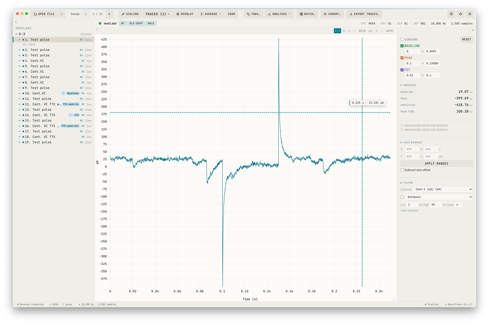

To switch to a different recording, simply open another file —
TRACER replaces the current one. There is no separate close
command; closing the application window quits the program.

### Recent files

The toolbar's **Open File** button has a small chevron (▾) next to
it that opens a list of recently opened files, most recent first.
Clicking an entry reopens that file directly. The list holds up to
ten entries and survives between sessions; **Clear recent** at the
bottom of the list empties it.

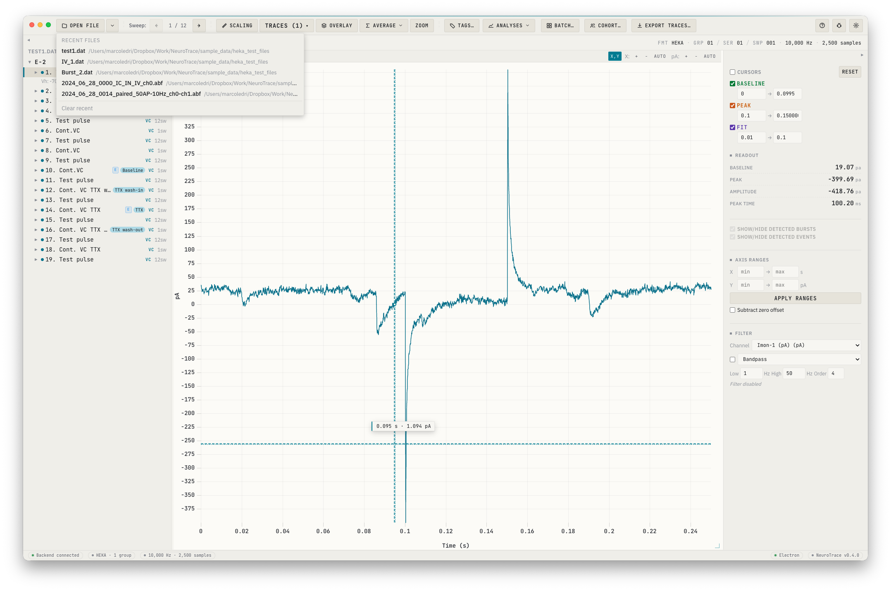

If a recently-opened file has been moved or deleted, TRACER will
report the failure and remove the entry from the list.

### Per-recording state

Whenever you run an analysis, mark sweeps as excluded, build an
averaged sweep, or change a per-channel filter, TRACER writes
the result to a small JSON sidecar named `<recording>.tracer`
placed next to the original file. The sidecar contains analysis
results, UI state, and any custom labels — but never a copy of the
raw signal. Reopening the recording later restores everything from
this file.

You can safely move a recording and its sidecar together. If the
sidecar is missing, the recording opens cleanly and a fresh one is
written the first time you change anything worth saving.

### Reporting bugs and sending feedback

Click the **bug icon** in the top-right of the toolbar (next to the
help icon) — or run **Report a bug** from the command palette
(`⌘K` / `Ctrl+K`) — to open an in-app form. Describe what
happened in plain language; you do not need a GitHub account, the
form is anonymous by default, and submission stays inside the app.

Alongside your description TRACER attaches a small block of
diagnostic context: app version, OS, the analysis window you were
in, the recording's format and group/series count, the most recent
error message, and a random submission ID. Filenames, file paths,
recording data, and any personally-identifying field are
deliberately *not* sent. A "What we'll send" expander at the
bottom of the form shows the exact lines of context being attached
so you can review them before clicking submit.

If you would like a reply, fill in the optional email field on the
form; otherwise leave it blank to stay anonymous.

---

## 2. The Toolbar

The toolbar runs across the top of the window and groups the
controls you will reach for most often: opening files, navigating
sweeps, choosing what to display, and launching analysis windows.
Buttons that require a recording are disabled until one is open;
those that operate across files (Tags, Batch, Cohort, Export Traces)
remain available at all times.

From left to right, the toolbar is laid out in five regions:
**file**, **sweep**, **display**, **analyses**, and **status /
settings**.

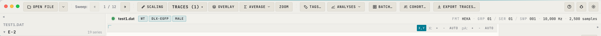

### File

**Open File** opens the standard file picker. The chevron next to
it opens the **Recent files** list described above.

### Sweep

For episodic recordings, the **Sweep** group shows the current
sweep number alongside the total — for example *3 / 47* — flanked
by **←** and **→** buttons that step backwards and forwards. The
counter itself is read-only; the arrow buttons and the matching
keyboard arrows are the only way to step. See the keyboard
reference in chapter 8 for the full set.

For continuous recordings (a single sweep longer than about a
minute), the counter still reads *1 / 1* but navigation happens
through the viewport bar rather than the sweep arrows; see the
**Trace Viewer** chapter.

### Display

These controls govern what is drawn in the trace viewer.

- **Scaling** opens the per-channel scaling modal, where you can
  override a channel's units (for example, mark a channel as `pA`
  when the file claims `V`) or apply a numeric multiplier. Useful
  when a recording was saved with the wrong amplifier gain or with
  a generic unit. Right-clicking a channel in the **Traces**
  dropdown opens the same modal pre-focused on that channel.

- **Traces** lists every recorded channel and the stimulus trace
  with a checkbox next to each. Use it to hide channels you don't
  want to see; the choice is saved per series.

- **Overlay** turns on a translucent overlay of every sweep in the
  current series, drawn on top of the active sweep. This makes it
  easy to see how a response evolves across an experiment without
  flipping through sweeps one at a time. The lowercase keyboard
  shortcut is `o`.

- **Average ▾** opens a small popover for building an *averaged
  sweep* — a virtual sweep computed as the mean of a chosen subset.
  Pick the source (**All sweeps**, **Selected**, or a **Range**
  with from/to inputs), give it a label, and click **Create**. The
  resulting average appears in the Tree Navigator under the same
  series as a regular sweep, can be displayed and analysed like
  any other, and is persisted in the sidecar. The same popover
  lists existing averages and lets you delete them. The lowercase
  shortcut `a` opens it.

  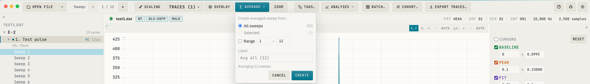

- **Zoom** changes what click-and-drag does in the trace viewer.
  With Zoom **off** (the default), dragging **pans** the view; with
  Zoom **on**, dragging sketches a rectangle and the viewer zooms
  into it on release. The mouse wheel always zooms regardless of
  this toggle — see chapter 4 for the full set of wheel and
  modifier-key combinations. The lowercase shortcut `z` switches
  modes.

### Analyses, tagging and cross-recording tools

The **Tags…** button opens the **Metadata** window, where you can
attach tags and notes to a recording, group, or series. Tags drive
the **Batch** and **Cohort** workflows that follow, so it sits
deliberately just before the Analyses dropdown — read the toolbar
left-to-right and you have *tag → analyse → batch → aggregate*.

**Analyses ▾** opens the menu of per-recording analysis windows.
Each entry opens a dedicated window devoted to one kind of analysis;
they are documented one chapter at a time in Part II of this manual.

| Menu entry | Chapter |
|---|---|
| Cursor Measurements | 9 |
| Rs / Rin / Cm | 10 |
| I-V Curve | 11 |
| Action Potentials | 12 |
| Paired Recording | 16 |
| Event Detection | 13 |
| Burst Detection | 14 |
| Field Potential | 15 |
| Spectral Analysis | — (experimental) |

The **Spectral Analysis** entry is present in the menu but is still
under construction; it is not documented in this manual and the
window it opens should be considered a preview.

Several windows can be open at once, and they stay in sync with the
main window: changing the selected sweep or moving a cursor in one
place updates the others.

The next three buttons operate across recordings rather than within
one, and so are available even when no file is open:

- **Batch…** replays a tagged template's analyses across every
  recording in a folder, so a parameter set you have tuned on one
  cell can be applied to a whole experiment in one go.

- **Cohort…** aggregates per-cell metrics across a folder of
  already-analysed recordings, producing pooled tables and summary
  plots.

- **Export Traces…** builds publication-ready figures from sweeps
  drawn from one or more recordings — useful for assembling a
  multi-cell figure without leaving the app.

### Status, help and settings

The right-hand end of the toolbar is now reserved for application
state and global settings. The current recording's identity —
filename, metadata-status dot, and tag chips — has moved to a
dedicated **recording header strip** below the toolbar (see
*Recording header* at the end of this chapter); the toolbar itself
keeps only:

- A **Loading…** indicator, shown while the backend is doing work
  (running an analysis, opening a large file).
- A **Help** button (the small `?` icon) that opens the help modal —
  a keyboard-shortcut cheat sheet plus an *Open user manual*
  button. The help modal is also reachable by pressing `?` anywhere
  outside an input.
- A **Report a bug** button (the bug icon) that opens an in-app
  feedback form. No GitHub account needed; submission stays inside
  the app and includes a small block of automatic diagnostics. See
  *Reporting bugs and sending feedback* in chapter 1 for what's
  attached.
- The gear (**⚙**) button at the far right that opens the
  **Settings** popover. Settings are global rather than
  per-recording.

The Settings popover's headline controls are:

- **Palette** chooses among **Precision** (the default — a
  high-contrast, neutral scheme tuned for daytime work),
  **Classic** (neutral greys with cool blue accents), and
  **Telegraph** (warm amber-on-near-black for dark mode,
  ink-on-vellum for light). Each palette ships with a dark and a
  light variant.

- **Theme** switches the active variant of the current palette
  between **Light** (☀, the default for new installs) and **Dark**
  (☾). Existing users keep whatever they had persisted.

- **UI Font** sets the application's interface font, with **IBM
  Plex Sans** as the default and Inter, SF Pro, Helvetica Neue, and
  the system default as alternatives.

- **Code Font** sets the monospace font used in tables and numeric
  read-outs. **JetBrains Mono** is the default; Fira Code, SF Mono,
  and Consolas are also available.

- **Font Size** offers a small range (11–15 px) to suit your display
  and viewing distance. The change applies live.

- **Trace colors** lists six colour slots — five for recorded
  channels and one for the stimulus trace — each with a colour
  picker and a small **×** to clear an override and fall back to the
  palette default. **Reset all** restores every slot at once. Trace
  colours are part of the global theme, not a per-recording setting,
  so the channel you usually keep blue stays blue across files.

A short preview ("UI preview: The quick brown fox" / "Code: fn(x) =>
x * 2") sits at the bottom of the popover so you can compare font
choices at a glance.

### Recording header

Once a recording is loaded, a thin **recording header strip**
appears between the toolbar and the trace viewer. It carries the
information that identifies and characterises the file you are
looking at, organised into two zones:

- **Left** — a colour-coded **metadata-status dot** (green /
  yellow / red, indicating how much metadata has been filled in
  for the recording), the **filename** (hover to see the full
  path), and any **file-level tag chips** attached through the
  Metadata window.
- **Right** — the file format, the current **group / series /
  sweep** position (zero-padded, e.g. *grp 01 / ser 03 / swp 042*),
  the sample rate, and the sample count of the currently displayed
  sweep.

The strip stays visible while you work, so the file you are
analysing is always identified at a glance — you no longer need to
look back at the toolbar to confirm which recording is open. When
no recording is loaded, the strip disappears and the welcome
surface fills the centre of the window instead.

---

## 3. The Tree Navigator

Down the left side of the window is the **Tree Navigator** — the
table of contents of the current recording. It mirrors the way
Patchmaster, pCLAMP and most other acquisition systems organise
their data, with three nested levels: a recording is divided into
**groups** (typically one per cell or experiment), each group
contains one or more **series** (a contiguous block of sweeps run
under a single protocol), and each series contains a number of
**sweeps**. Selecting an entry in the tree controls what the trace
viewer shows; selecting more than one sweep also drives the
**Average** popover and the per-series workflows in the analysis
windows.

Press `F1` to hide and show the tree at any time.

### Groups

Each group is shown as a labelled row with an expand/collapse
chevron and a small badge giving the number of series it contains.
Groups can be collapsed away when they are not the focus — useful
for long recording sessions with several cells in the same file.

### Series

Series are the workhorse level: nearly every analysis runs on a
single series at a time. Each row carries:

- **A type badge** — *VC* (voltage clamp), *CC* (current clamp), or
  *FP* (field potential) — colour-coded so you can tell at a glance
  what kind of recording you are looking at. TRACER guesses the
  type from the series label, the protocol, and the holding
  potential; if it is wrong, you can override the channel units in
  the **Scaling** dialog.

- **A sweep-count badge** showing how many sweeps the series
  contains.

- **Analysis-presence pills** indicating which analyses have already
  been run and saved. The letters are deliberately short:

  | Pill | Analysis |
  |---|---|
  | C | Cursor Measurements |
  | R | Resistance (Rs / Rin / Cm) |
  | IV | I-V Curve |
  | AP | Action Potentials |
  | P | Paired Recording |
  | E | Event Detection |
  | B | Burst Detection |
  | FP | Field Potential |

  Hovering a pill names the full analysis. The pills update
  automatically as analyses are run and cleared.

- **A tag chip** showing the first metadata tag attached to the
  series, when present (see chapter 16). Hovering reveals the full
  tag list.

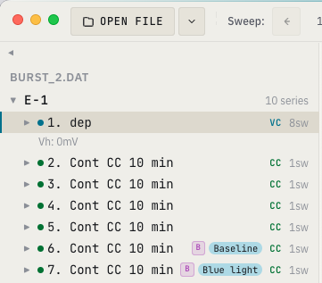

### Sweeps

Inside an expanded series, every sweep is listed in order. Click a
sweep to load it into the trace viewer; the **Sweep** counter in
the toolbar updates accordingly. Sweeps that have been excluded
from analysis are drawn in a dimmer style so they are easy to spot.

Multi-sweep selection follows standard conventions:

- **Click** a sweep to select it.
- **Shift-click** to extend the selection to a contiguous range.
- **⌘ / Ctrl-click** to add or remove individual sweeps from the
  selection.

The current selection is what the **Average** popover, the **Batch**
analysis, and several analysis windows use when their *Selected*
mode is chosen.

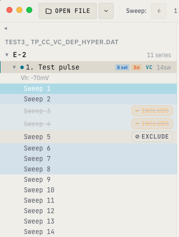

### Averaged sweeps

When you create an averaged sweep through the toolbar's **Average**
popover, it appears in the tree under the same series, named
`Avg: <your label>`. These virtual sweeps are first-class citizens
of the tree: click them to display, run analyses on them, or
include them in figures. They are stored in the sidecar with the
underlying samples, so they survive a restart and can still be
reviewed even if the original sweeps are later excluded.

---

## 4. The Trace Viewer

The trace viewer fills the centre of the window and is where
virtually all interaction with the signal happens. Its job is to
draw the current sweep — or the current viewport, if the recording
is continuous — clearly, quickly, and at any zoom level, while
giving you the controls you need to measure, compare, and annotate
what you see.

### How the trace is drawn

A typical electrophysiology recording contains far more samples
than the screen has pixels, so showing every sample would be
expensive and pointless. TRACER decimates the visible region
down to roughly four thousand points using **LTTB** — the
**Largest-Triangle-Three-Buckets** algorithm — before handing the
result to the plot. LTTB divides the time axis into buckets and,
within each bucket, picks the sample whose triangle with the
previously-kept point and the next bucket's centroid has the
largest area. The effect is that visual peaks, troughs, and
inflection points are preserved even at extreme zoom-out, while
flat regions collapse cleanly. Numerical analyses are always run on
the full-resolution data, never on the decimated copy you see.

The plot has a primary Y axis on the left for the recorded signal
and a secondary Y axis on the right for the stimulus or any
additional trace you have made visible. Both axes carry units —
*mV*, *pA*, or whatever the file declares — and rescale
automatically when you switch sweeps or channels.

### Mouse interactions

The mouse wheel zooms one axis at a time, with modifier keys
selecting which:

| Wheel | Action |
|---|---|
| (no modifier) | Zoom the **X axis** in or out, anchored at the cursor position |
| **Option / Alt** + wheel | Zoom the **Y axis** nearest the cursor — useful for multi-channel files where each channel can be zoomed independently by hovering it before scrolling |
| **Shift** + wheel | Zoom the **stimulus axis**, when the stimulus trace is visible |

Anchoring at the cursor means the time (or value) under the pointer
stays put while the rest of the axis expands or contracts around
it, so you can drill into a region just by moving the pointer there
and scrolling.

Drag-and-release behaviour is governed by the toolbar's **Zoom**
toggle (or the `Z` shortcut):

- With **Zoom off** (the default), click-and-drag inside the plot
  **pans** the view — the natural way to slide a long sweep across
  the window.
- With **Zoom on**, click-and-drag sketches a rectangle and the
  viewer zooms into it on release. Useful for picking out a precise
  time-and-amplitude window in a single gesture.

**Right-clicking** the trace opens a small context menu with two
entries:

- **Copy PNG** — copies the current view to the clipboard as a
  raster image.
- **Save PNG…** — writes a PNG to disk via a file dialog.

Both export at the displayed resolution. The trace viewer does not
offer vector export from this menu — for publication-ready figures
with multiple sweeps, scale bars, and annotations, use the **Export
Traces** window described in chapter 17, which writes vector SVG
and PDF. (Cohort statistics plots are the one exception: their
right-click menu also offers SVG, because the plot is rendered as
SVG by the backend.)

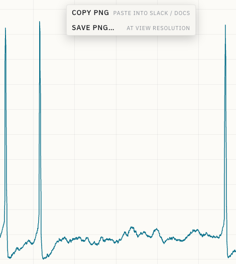

### The viewport bar and slider

For episodic recordings — one sweep per protocol step — there is
nothing fancy to navigate: the toolbar's `←` / `→` buttons step
between sweeps. For **continuous** recordings, where a single sweep
can run for many minutes, TRACER switches into a viewport-based
mode:

- The plot shows a time-window of the full sweep at a time.
- A **viewport bar** above the plot exposes a **Reset zoom** button
  and the active zoom-and-pan controls.
- A **viewport scroll bar** at the bottom of the viewer behaves
  like an ordinary application scroll bar: a thin track spanning
  the full duration of the recording, with a coloured handle
  showing where in the recording the visible window currently sits
  and how wide it is. Click anywhere on the track to jump the
  viewport there, or click-and-drag to scroll continuously. The
  handle's width is determined by the X-axis zoom level — to make
  the visible window wider or narrower, zoom out or in with the
  mouse wheel.

The arrow keys and `Home` / `End` keep working in either mode; in
continuous mode they scroll by one viewport width, with `Shift`
modifying the step size.

### Cursors

Cursors are the foundation of every measurement in TRACER.
Three independent **pairs** are available, drawn as translucent
shaded bands across the plot:

| Pair | Colour | Typical use |
|---|---|---|
| Baseline | green | The pre-stimulus window from which the resting level is measured |
| Peak | yellow | The window containing the response of interest |
| Fit | purple | The window over which an exponential is fitted (decay τ, capacitive transient) |

The exact shades depend on the active palette and theme variant, but
the same green / yellow / purple identity is preserved across both
**Classic** and **Telegraph** so that "baseline" always reads as the
green band wherever you see it. Individual analysis windows can
introduce additional cursor pairs of their own — for example, the
Field Potential window distinguishes a *volley* window from the
*fEPSP* window — and those are colour-coded separately within each
chapter.

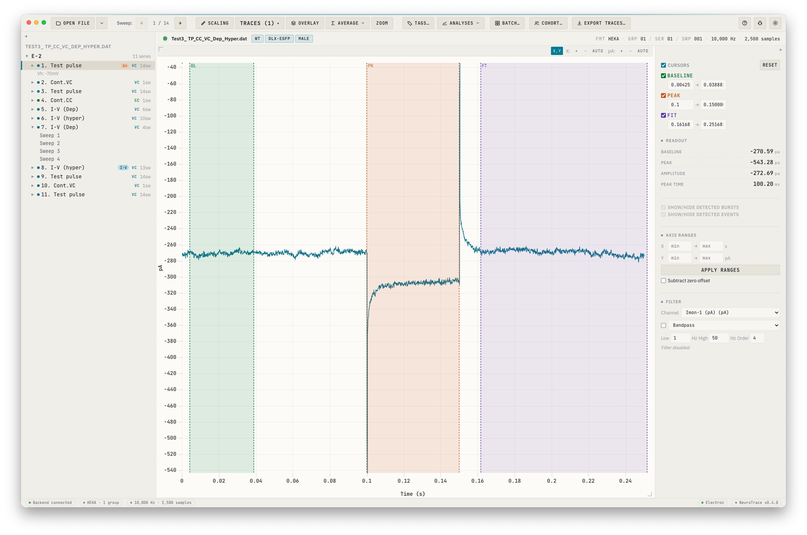

Each pair is configured in the **Cursor Panel** on the right (see
chapter 5) and can be shown or hidden independently. To move a
cursor on the plot, drag one of its edges; to translate the whole
band without changing its width, drag the interior. The cursor
edge snaps to the pointer within an eight-pixel tolerance so a
quick drop is enough.

By default, the cursors are **off** in the main viewer — most
work happens inside the analysis windows, which display their own
cursors against their own mini-viewers. Switch them on from the
Cursor Panel when you want to make a quick measurement against the
main display.

### Analysis markers

When an analysis has been run, its results are drawn back onto the
main trace as a way of inspecting the detection in context:

- **Burst markers** appear as shaded regions over the duration of
  each detected burst.
- **Action-potential markers** are dots at each detected spike. A
  bare-detection run places a single red dot on the peak. When
  kinetics have been measured (in the AP window's Kinetics tab),
  each spike instead carries a small cluster of coloured dots at
  the points the AP analysis identified — red at the peak, grey at
  the threshold, two yellow dots at the half-amplitude crossings
  joined by a dashed line, orange at the fAHP, and a darker orange
  at the mAHP. Spikes you have added or kept by hand are drawn with
  an extra outer ring around the peak dot, so manual edits are
  visually distinct from auto-detections.
- **Event markers** are dots placed at each detected event, colour-
  coded by what they represent (foot, peak, decay).

Markers respect the **Zero-offset** state of the trace, so they
follow the signal when you toggle the offset on or off rather than
floating off in the original sample frame.

### The stimulus trace

When the file contains a reconstructable stimulus — for HEKA
recordings, this means a `.pgf` protocol file is present alongside
the `.dat` — TRACER draws the stimulus on the secondary Y axis
in the colour assigned to the stimulus slot in **Settings**. The
stimulus is a regular trace as far as the viewer is concerned, with
its own checkbox in the **Traces** dropdown.

If your file does not carry a usable protocol, the secondary axis
is simply empty; analyses that need the stimulus (for example, the
I-V Curve) provide a manual fallback for entering the protocol
parameters by hand.

### Zero offset

The **Zero offset** toggle (per channel, accessible from each
analysis window's mini-viewer header strip; see also the per-trace
state in the sidecar) subtracts the first sample of the displayed
window from every other sample, so the trace starts at zero on the
Y axis. This is purely a display aid: the underlying data is not
modified, and analyses always work in the original units. It is
most useful for visually comparing the shapes of two traces with
different DC offsets, or for displaying a small response without
the surrounding baseline taking up most of the axis range.

### Filtering

A live, zero-phase filter can be applied to any channel. Filter
controls live in the **Cursor Panel** (next chapter) and consist of
a master enable checkbox, a type selector — **Lowpass**,
**Highpass**, or **Bandpass** — one or two cutoff frequencies in
hertz, and an order from 1 to 4. A filtered trace is drawn in
place of the raw one in the main viewer and in any analysis window
that inherits the filter on opening.

The filter itself is a Butterworth IIR run **forwards and
backwards** through SciPy's `sosfiltfilt`, which gives a zero-phase
response — peaks and troughs stay where they were, just smoothed.
Edge handling uses constant (edge-value) padding rather than the
default odd-reflection, which avoids ringing at the very start of
traces that begin away from zero. For very short signals (fewer
samples than `6 × n_sections`), TRACER falls back to a one-way
`sosfilt` so the filter still runs without raising an error.

Filters are stored per channel in the sidecar, so each channel can
carry its own setting and that setting is restored next time you
open the recording.

### Hover read-out

A small **x,y** button at the right-hand end of the viewer's
control strip toggles a coordinate read-out that follows the
pointer as you hover, showing the time and the value at the nearest
sample. It is on by default and is helpful for quick measurements
that do not justify placing a full pair of cursors — checking the
amplitude of a single event, for example, or noting the time of an
obvious feature.

---

## 5. The Cursor Panel

The right-hand sidebar is the **Cursor Panel**. It carries the
positions of the three cursor pairs, a continuously-updated read-out
of what the cursors currently enclose, and the per-channel filter
controls described in the previous chapter. Analyses themselves are
launched from the toolbar's **Analyses** menu (chapter 2), not from
this panel — the panel exists to set up the inputs, not to dispatch
the work. Press `F2` to hide and show it.

### Cursor configuration

Three rows — **Baseline**, **Peak**, and **Fit** — let you set the
exact start and end times of each cursor pair in seconds, absolute
to the sweep. Each row has a checkbox that shows or hides that pair
in the main viewer. Editing a value in the panel moves the cursor
on the plot in the same frame; dragging a cursor on the plot
updates the inputs in the panel. The two views are always in sync.

### Live read-out

Underneath the cursor configuration is a compact read-out
recomputed in real time as you move the cursors or step between
sweeps. It carries:

- **Baseline** — the mean of the signal over the baseline window,
  in the channel's units.
- **Peak** — the sample inside the peak window with the largest
  absolute deviation from the baseline. The sign is preserved, so
  inward currents read negative and outward currents read positive.
- **Amplitude** — the peak minus the baseline.
- **Peak time** — the time of the peak sample relative to the start
  of the sweep, in milliseconds.

The panel deliberately keeps this set small. Standard deviation,
noise estimates, exponential-fit time constants, rise times,
half-widths, and similar derived metrics are all available, but
they live in the **Cursor Measurements** window (chapter 9), where
they can be computed across many sweeps and exported as a table.
Treat the panel read-out as a quick sanity check; reach for the
Cursor Measurements window when you want a record of what you
measured.

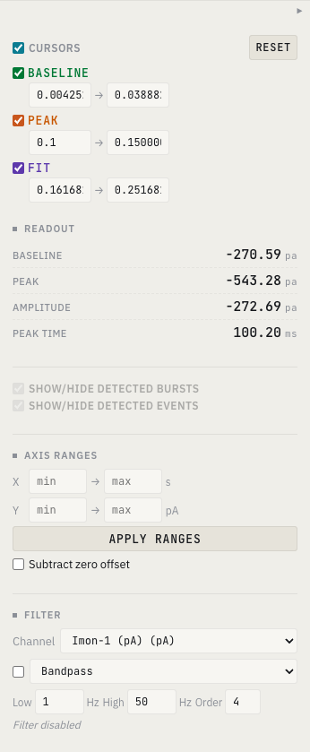

### Auto-placed cursors

Several analyses can suggest cursor positions — for example, the
Field Potential window can place the baseline and response windows
relative to the stimulus onset detected from the protocol file.
When this happens, the values appear in the cursor inputs and the
shaded bands move on the plot. You are always free to nudge them
afterwards; nothing in TRACER will overwrite a manual edit
without asking.

### Filter

The lower half of the panel carries the filter controls described
in chapter 4: enable, type, cutoff(s), order. The settings are
remembered per channel so that, for instance, you can leave a
50-Hz notch on a noisy field-potential channel while the patched
cell on the same recording stays unfiltered.

---

## 6. Settings and Theme

The toolbar chapter introduced the **Settings** popover at a glance.
This chapter covers what each setting does in a little more detail
and explains how TRACER's two-axis approach to appearance —
**theme** and **palette** — is meant to be used. All settings here
are global: they apply to every window and every recording.

### Palettes and themes

A **palette** is a coordinated set of colours; a **theme** is the
light or dark variant of that palette. The two are independent,
which means there are six combinations available rather than the
usual two. TRACER ships with three palettes:

- **Precision** — the default for new installs. A high-contrast,
  neutral scheme tuned for working under daylight: clean
  near-white backgrounds in the light variant, deep ink on charcoal
  in the dark. Reach for it when accurate colour reading matters
  (judging fits, comparing trace colours) and you want the
  interface to step out of the way.

- **Classic** — neutral greys with cool blue accents. The look of
  earlier TRACER builds, kept as an option for users who prefer
  it.

- **Telegraph** — warm and high-contrast. The dark variant is
  amber-on-near-black, reminiscent of an old terminal; the light
  variant is dark ink on a vellum background. Both are intended for
  workflows where contrast matters more than neutrality, and for
  the simple pleasure of a less utilitarian-looking interface.

The **Theme** toggle (☀ Light / ☾ Dark) flips the active palette
between its two variants without changing the palette itself. The
default theme for fresh installs is **Light**; existing users keep
whatever they had previously chosen.

### Fonts

The **UI Font** dropdown sets the typeface used for menus, buttons,
labels, and panels. **IBM Plex Sans** is the default. Alternatives
are **Theme default** (defers to whatever the active palette
specifies, typically the same as the IBM Plex default), **Inter**,
**SF Pro**, **Helvetica Neue**, and **System Default** (delegates
to the operating system — San Francisco on macOS, Segoe UI on
Windows, the system sans-serif on Linux).

The **Code Font** dropdown sets the monospace face used in tables,
numeric read-outs, and copyable values. **JetBrains Mono** is the
default, with **Theme default**, **Fira Code**, **SF Mono**, and
**Consolas** as alternatives. A monospace face matters here because
the alignment of decimal points across rows is what makes a results
table scannable.

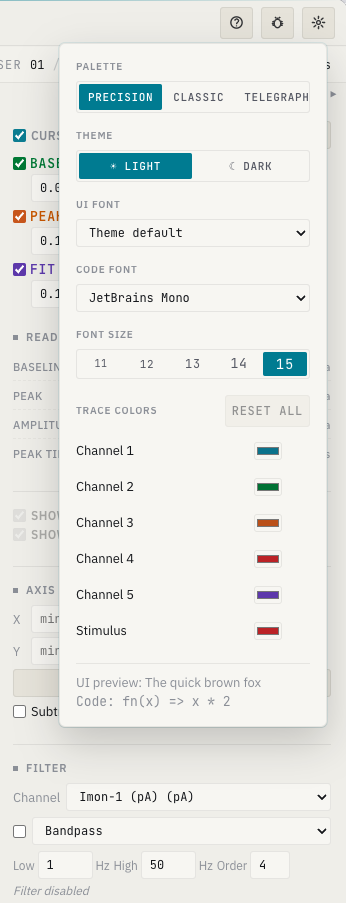

A small **UI preview** and **Code** preview line at the bottom of
the popover gives you an immediate sense of how a font choice will
look before committing.

### Font size

The **Font size** stepper covers a small range — 11 to 15 pixels —
suitable for most displays. The change applies live, including to
existing analysis windows; pick the smallest size that you can read
comfortably to leave more room for plots.

### Trace colours

TRACER gives every channel its own colour slot so that, once
you have settled on (say) blue for the patched cell and red for the
field electrode, that mapping persists across files. Six slots are
provided: five for recorded channels (1 through 5) and one for the
stimulus trace.

Each slot has a colour picker and a small **×** button that clears
your override and falls back to the palette's default for that slot.
**Reset all** clears every slot at once. The slot you have
overridden is shown filled in, and the default is shown with a
muted indicator, so you can tell which colours are yours and which
came from the palette.

Trace colours are global rather than per-recording, which suits the
common case of running similar protocols on similar configurations
across many files. If you need different colours for a particular
figure, build it in the **Export Traces** window, where colours can
be set per sweep.

---

## 7. Where Your Work is Stored

TRACER persists state in two places. Understanding which is
which makes the difference between a setting that follows the
recording around and one that follows you, the user, around.

### Application preferences

Global, user-level state is written to a small **preferences.json**
file inside the platform's standard application-data directory
(`~/Library/Application Support/TRACER` on macOS,
`%APPDATA%\TRACER` on Windows, `~/.config/TRACER` on
Linux). This file holds:

- **Window bounds** — the size, position, and maximised state of
  the main window.
- **Recent files** — the list shown in the Open File dropdown.
- **Layout** — sidebar widths, collapse state, focus mode.
- **Theme** — palette, theme variant, fonts, font size, and trace
  colours.

It also holds a few per-file caches that mirror what is in the
sidecar (excluded sweeps, averaged sweeps, saved analysis results,
form parameters, and the like), keyed by file path. These exist so
that TRACER can restore your view of a recording before it has
finished loading the sidecar from disk; the sidecar is the
authoritative copy.

### The recording sidecar

Per-recording state is written to a JSON file named
`<recording>.tracer`, placed next to the recording itself. It
contains everything that is specific to that file:

- **Analysis results** — Cursor Measurements, Resistance, I-V
  Curve, fEPSP, Bursts, Action Potentials, Events, Paired
  Recording. Each module stores its own block, keyed by
  *group:series* (and, where relevant, by sub-mode such as `ltp`
  for Field Potential).
- **UI state** — the set of excluded sweeps, the catalogue of
  averaged sweeps (with their underlying samples), the per-channel
  zero-offset states, the visible-traces list, and the per-channel
  filter configurations.
- **Metadata** — the version of TRACER that created the file,
  the timestamp, and a reference back to the source recording.

When you move a recording to a different machine, copy its sidecar
along with it and everything you have done — exclusions, averages,
analyses, filters — comes with the file. If the sidecar is missing,
TRACER opens the recording cleanly and writes a fresh one the
first time you make a change worth saving. Sidecars do not store a
copy of the raw recording, so they stay small even for long
experiments. The one exception is averaged sweeps, whose computed
samples are written into the sidecar so they can be displayed and
analysed without having to recompute the average from the original
sweeps every time the file is opened.

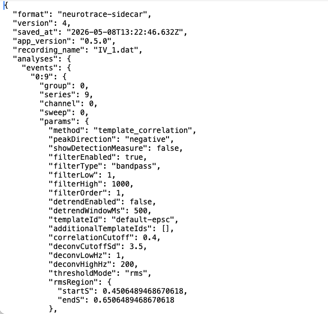

### What is *not* persisted

Cursor positions in the main viewer are deliberately ephemeral: they
reset on every file open. Cursor positions inside an analysis
window, in contrast, are persisted as part of that analysis's
form parameters, so a window you reopen on the same series comes
back exactly as you left it.

---

## 8. Keyboard Shortcuts

All shortcuts are inactive while a text input or a numeric field
has the keyboard focus, so typing a value into a parameter input
will never accidentally trigger a navigation command. Click on the
trace plot once if you want the keyboard to drive navigation again.

### Global

All single-letter shortcuts use the **lowercase** key with no
modifier keys.

| Key | Action |
|---|---|
| `⌘K` / `Ctrl+K` | Open the **command palette** |
| `?` | Open the **help modal** (the keyboard cheat sheet shown by the toolbar's `?` button) |
| `Esc` | Close any open modal, popover, palette, or context menu |
| `F1` | Toggle the left sidebar (Tree Navigator) |
| `F2` | Toggle the right sidebar (Cursor Panel) |
| `f` | Toggle focus mode — hides both sidebars at once |

The **command palette** is a search-driven launcher for every
action in the application: open file, recent files, sweep
navigation, view toggles, every analysis window, the manual,
theme and palette switching. Type to filter, ↑ / ↓ to navigate,
↵ to run, `Esc` to close. It is the fastest way to reach anything
that does not have a dedicated button on the toolbar — for
example, to open the **Cursor Measurements** window, press `⌘K`
and start typing *cursors*. Each Part II chapter notes the
keyword that brings up its window.

TRACER does not install a native menu bar, so opening a file
has no dedicated keyboard shortcut: use the toolbar's **Open File**
button, drop a file onto the welcome surface, or open the command
palette and pick an entry from the *Recent* list. (The help modal
hints at `⌘O`; it is not currently bound and will be wired in a
future release.)

### Trace navigation

| Key | Episodic mode | Continuous mode |
|---|---|---|
| `←` / `→` | Previous / next sweep | Scroll by one viewport width |
| `Shift+←` / `Shift+→` | — | Scroll by half or two viewport widths |
| `Home` / `End` | First / last sweep | Jump to the start / end of the recording |

The **Burst Detection** window (chapter 14) extends this with
`PageUp` / `PageDown` to jump three viewport widths at a time, plus
left-click to add and right-click or double-click to remove a
manual burst.

### Toolbar shortcuts

| Key | Action |
|---|---|
| `o` | Toggle the **Overlay** of all sweeps |
| `a` | Open the **Average** popover |
| `z` | Toggle **Zoom mode** (drag-rectangle to zoom vs drag to pan) |

### Tables

Most analysis-window tables share a common set of shortcuts:

- **Click** to select a row.
- **Shift-click** to extend the selection to a contiguous range.
- **⌘ / Ctrl-click** to add or remove individual rows.
- **Right-click** a row to copy it as TSV.
- **⌘C / Ctrl+C** copies the current selection as TSV (where wired).

Pasting any of these into a spreadsheet preserves the column layout,
so building a working figure from a TRACER results table is
usually a matter of selecting, copying, and pasting.

---

# Part II — Analysis Modules

The chapters that follow each cover one analysis window. Every
window opens as its own desktop window — separate from the main
TRACER window — and stays in sync with the main view through a
shared sweep selection and cursor state. Several windows can be
open at once; closing them does not lose your work, because each
saves its results into the recording's sidecar. Where a window
exposes a choice of methods, the methods themselves are explained
inline next to the parameter that selects them.

---

## 9. Cursor Measurements

The **Cursor Measurements** window is the workhorse of TRACER.
It takes the same idea as the cursor pair on the main viewer — a
pre-stimulus baseline window and a post-stimulus peak window — and
multiplies it: up to ten independent **slots**, each with its own
peak window and its own optional curve fit, all measured against a
common baseline and run across an entire series. The result is a
table of per-slot, per-sweep numbers that you can copy into a
spreadsheet, save to CSV, or eyeball directly to see how a
preparation evolves over an experiment.

In Stimfit terms, this window does what a dozen pairs of cursors
plus the menu-driven *Measure / Fit* commands would do, but
batched, persisted, and visualisable in one place.

### When to use this window

Reach for Cursor Measurements when the question you have is
amplitude- and timing-shaped — peak amplitude, time-to-peak, rise
time, half-width, area under the curve, or the time constant of an
exponential decay. It is the right tool for things like:

- Measuring fEPSP slope and amplitude per sweep across a long
  stimulation protocol.
- Tracking the amplitude of an evoked current across many sweeps
  to see whether the response is rundown- or potentiation-prone.
- Fitting a monoexponential to the decay phase of a synaptic event
  and reporting τ.
- Splitting a complex response into early and late components by
  giving each its own slot.

For purely timing-of-spikes work, use **Action Potentials**
(chapter 12); for spontaneous events, use **Event Detection**
(chapter 13).

*Reach this window from the toolbar's **Analyses ▾** menu, or
press `⌘K` and type **cursors**.*

### Window layout

The window is divided into a thin top bar and a two-column body.

The **top bar** carries the recording selectors — group, series,
and channel — followed by a sweep preview navigator: ←, an editable
sweep number, and →. The preview lets you scroll through the
series sweep by sweep without committing to a "run on this single
sweep" choice; the run-mode selector lower down the window controls
that separately.

Below the top bar, the **left panel** holds the parameters: the
filter, the shared baseline window, one card per enabled slot, and
the run controls pinned to the bottom. A vertical splitter between
the left panel and the rest of the window lets you widen it when
you have many slots configured.

The **right panel** is split horizontally: the **mini-viewer** at
the top draws the current preview sweep with all the cursor bands
overlaid, and the **results panel** at the bottom shows a tabbed
table of measurements. A horizontal splitter between the two
adjusts how much vertical space each gets.

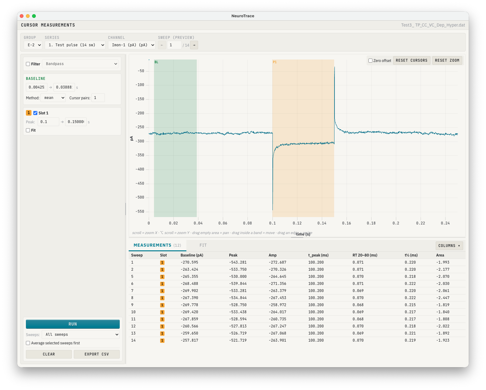

### Slots

A *slot* is one peak window plus, optionally, one fit window. The
window supports up to ten slots, numbered 1–10, each drawn in its
own colour both on the mini-viewer and in the results table. Slots
are independent — slot 1 might cover the early fast component of a
synaptic response, slot 2 the late slow component, slot 3 a
control window, and so on — but they all share the single baseline
window defined at the top of the left panel.

Increase the **Cursor pairs** number on the left panel to enable
more slots; each newly enabled slot appears as its own card below.
You do not need to use them in order, and disabling a slot leaves
its configuration intact for next time — the slot card simply dims
and stops contributing to the run. Slot colours are assigned
automatically and reused cyclically; they are not user-pickable.

### Configuring a slot

Each slot card carries:

- **Peak window** — start and end times, in seconds, defining the
  region within which the slot's peak will be measured. You can
  type into the inputs or drag the band on the mini-viewer; both
  views stay in sync.
- **Fit checkbox** — when ticked, an additional fit window appears,
  along with a function selector. Until the checkbox is on, no
  curve fit is performed for that slot.
- **Fit range** — start and end of the window over which the chosen
  function will be fitted. Like the peak window, this can be edited
  numerically or by dragging on the mini-viewer.
- **Fit function** — see the **Fit functions** section below.
- **Advanced fit options** — a small disclosure that exposes the
  optimiser's iteration limit (`max iter`), function-tolerance
  (`ftol`), and parameter-tolerance (`xtol`), plus a list of named
  initial-guess inputs for each parameter of the chosen function.
  Leave these blank to let TRACER pick reasonable starting
  values; fill them in only when you are fighting a stubborn fit.
  A **reset guesses** button clears any overrides.

### The mini-viewer

The mini-viewer at the top of the right panel draws the currently
previewed sweep, with the baseline band, every enabled slot's peak
band, and any active fit bands overlaid in their respective colours.
Move a cursor by dragging its edge to resize or by dragging its
interior to translate; numerical values in the left panel update
in real time.

Three small controls live in the **top-right corner** of the
mini-viewer header:

- **Zero offset** subtracts a baseline computed from the first few
  milliseconds of each previewed sweep, so traces with very
  different DC offsets can be compared by shape. It is a display
  aid only — the underlying analysis still works in the original
  units.
- **Reset cursors** distributes the baseline band into the first
  10 % of the visible time range and spaces every enabled slot's
  peak band evenly across the rest. Useful when you have zoomed in
  on a different region and want to start over with sensible
  positions.
- **Reset zoom** auto-fits the X and Y axes to the data extents.

A small help line under the plot reminds you of the wheel and drag
conventions: scroll to zoom X, Option/Alt-scroll to zoom Y, drag
empty space to pan, drag inside a band to move it, drag a band
edge to resize.

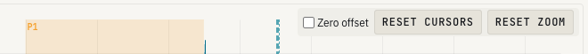

### The filter

A **Filter** section at the top of the left panel exposes the same
zero-phase Butterworth filter described in chapter 4 — Lowpass,
Highpass, or Bandpass — applied live to whatever is shown in the
mini-viewer. The filter is seeded from the main viewer's filter on
opening, so the trace you start with looks the way it did in the
main window, but you can change it here without disturbing the main
viewer's setting. Measurements always operate on the filtered trace
when the filter is enabled.

### The baseline window and method

A single **Baseline** window — start and end in seconds — applies
to every slot. The **Method** selector below it controls how a
single baseline value is computed from that window:

- **Mean** — the arithmetic mean of all samples in the window. The
  default; appropriate for stationary, well-behaved baselines.
- **Median** — the 50th percentile. More robust when the baseline
  contains occasional outliers (e.g., spontaneous events you do not
  want to fold into the reference).

The choice of method also affects how the baseline's spread is
reported in the results table: under **mean** the column is
standard deviation; under **median** it is interquartile range.

### The run controls

The bottom of the left panel pins the run controls so they remain
reachable as you scroll through slot cards.

- **Run** triggers the analysis on the backend with the current
  parameters and the chosen sweep set.

- The **Sweeps** dropdown picks what to run on:
  - **All sweeps** — every sweep in the selected series, minus any
    excluded ones.
  - **Range** — a contiguous range, with from/to inputs.
  - **Single sweep** — one specific sweep, picked by index.

- **Average selected sweeps first** averages the chosen sweep set
  *before* running the analysis, producing a single set of
  measurements (one per slot) instead of one row per sweep. This
  is useful when you want a single representative value for, say,
  a stable baseline period.

- **Clear** discards the current measurements (the parameters
  themselves are kept).
- **Export CSV** writes the visible measurements to a CSV file via
  the standard save dialog.

If a run fails, an inline red banner reports the error.

### The results panel

Below the mini-viewer, the results panel shows a table of
measurements with two tabs at the top: **Measurements** and **Fit**.
Each tab carries its own column-visibility set; click the
**Columns ▾** dropdown on the right of the tab strip to toggle
columns on or off. Your choice is remembered across sessions.

Within either table, the **Sweep** and **Slot** columns are always
locked, so you always know which row belongs to which sweep and
slot. Rows are click-selectable, with shift-click for ranges and
⌘ / Ctrl-click for individual additions; right-click a row for a
**Copy as TSV** entry, or select multiple rows first and copy them
in one go. Pasted into a spreadsheet, the columns line up directly.

The **Fit** tab is filtered automatically to show only those rows
that carry a fit result, and its columns differ accordingly: the
fit function name, R², residual sum of squares, and the fitted
parameters in `name=value` form.

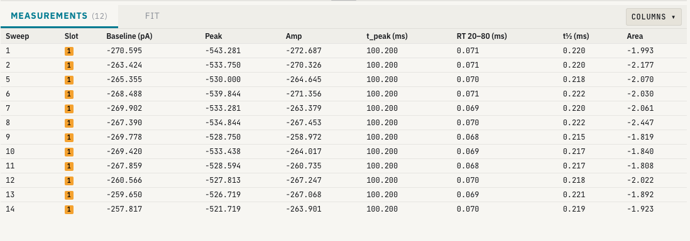

### Measurements

The Measurements tab carries the following columns. All times are
shown in milliseconds, all amplitudes in the channel's recorded
units, and all slopes in *units per second*.

- **baseline** — the mean (or median, per the baseline method) of
  the signal over the baseline window.
- **baseline sd** — the standard deviation of the baseline window
  under the mean method, or the interquartile range under the
  median method.
- **peak** — the sample inside the peak window with the largest
  *signed* deviation from the baseline. The sign is preserved, so
  inward currents read negative and outward currents read positive.
  Both the maximum and minimum are considered, and whichever is
  farther from the baseline wins; this means slots can detect
  upward and downward responses without you having to declare a
  direction.
- **amplitude** — peak minus baseline.
- **peak time** — the absolute time of the peak sample, measured
  from the start of the sweep.
- **time to peak** — the time from the start of the peak window to
  the peak itself; effectively the latency of the response within
  the cursor.
- **rise time 10–90 %** and **rise time 20–80 %** — the time the
  trace takes to climb from 10 % (or 20 %) of the signed amplitude
  to 90 % (or 80 %). TRACER finds the two crossing points
  walking back from the peak and **interpolates linearly between
  adjacent samples** so the result is not quantised to the sample
  rate. If either crossing cannot be found inside the cursor (for
  example, because the trace did not actually return to baseline
  before the window ended), the field is left blank rather than
  reported as a wrong number.
- **half-width** (FWHM, t½) — the duration during which the trace
  is above (or below, for downward responses) 50 % of the signed
  amplitude. Computed by interpolating the two 50 % crossings
  bracketing the peak.
- **rise slope** — the steepest slope of the rising phase, computed
  as the largest first-difference *dy/dt* between the start of the
  peak window and the peak itself, in the appropriate sign.
- **decay slope** — the steepest slope of the falling phase, from
  the peak to the end of the peak window.
- **R/D** — the ratio of rise slope to decay slope. Reported only
  when the decay slope is non-zero.
- **area** — the signed area enclosed between the trace and the
  baseline within the peak window, computed by trapezoidal
  integration. The units are *channel-units · seconds* — that is,
  picocoulombs for currents in pA, or millivolt-seconds for
  voltage. Charge transfer for inhibitory and excitatory events
  comes out negative and positive, respectively, in line with the
  sign convention for the peak.

### Fit functions

A slot's optional curve fit runs the chosen function against the
samples in the fit window using a least-squares optimiser. Eleven
functions are available; pick the one whose shape matches the
process you are studying. In the equations below, *x* is time
relative to the start of the fit window.

| Function | Equation | Parameters | Typical use |
|---|---|---|---|
| **Monoexponential** | *amp · exp(−x/τ) + offset* | amp, τ, offset | Single-time-constant decays: synaptic-current decay, capacitive transients |
| **Monoexponential with delay** | flat at *baseline* until *delay*, then exponential approach to *peak* with time constant *τ* | baseline, delay, τ, peak | Decays that begin some time after the start of the fit window |
| **Biexponential** | *amp₀ · exp(−x/τ₀) + amp₁ · exp(−x/τ₁) + offset* | amp₀, τ₀, amp₁, τ₁, offset | Decays with two distinguishable time constants (fast + slow) |
| **Biexponential with delay** | delayed rise-and-decay with two τ values | baseline, delay, τ₁, factor, τ₂ | Synaptic responses with a finite rise time and a separable decay |
| **Triexponential** | sum of three exponentials with a common offset | amp₀..amp₂, τ₀..τ₂, offset | Compound decays that resist a two-exponential description |
| **Triexponential with delay** | delayed three-component kinetics | baseline, delay, τ₁ₐ, factor, τ₂, τ₁ᵦ, p_τ₁ᵦ | Rare; reserved for kinetics that genuinely require three components and a delay |
| **Alpha function** | *A · (x/τ) · exp(1 − x/τ) + offset* | amp, rate, offset | Synaptic conductance or current waveforms with a rising-and-falling shape; peaks at *t = τ* |
| **Gaussian** | *amp · exp(−((x − μ)/w)²)* | amp, μ, w | Symmetric bell-shaped events; useful for, e.g., aligning to a peak in a histogram |
| **Hodgkin–Huxley g_Na** | *g′ · (1 − exp(−x/τₘ))³ · exp(−x/τₕ) + offset* | g′, τₘ, τₕ, offset | Activation/inactivation kinetics of voltage-gated sodium current |
| **Power-of-1 g_Na** | *g′ · (1 − exp(−x/τₘ)) · exp(−x/τₕ) + offset* | g′, τₘ, τₕ, offset | A simpler Na conductance form when the cubic term is unjustified |
| **Boltzmann** | *bottom + (top − bottom) / (1 + exp((V₅₀ − x) / slope))* | bottom, top, V₅₀, slope | Voltage-dependent activation or inactivation curves; *x* is voltage rather than time |

For each fit, the Fit tab reports:

- **R²** — the coefficient of determination; a quick goodness-of-fit
  number. Values close to 1 indicate that the model accounts for
  most of the variance in the fit window; low or negative values
  indicate a bad fit.
- **RSS** — the residual sum of squares, in the channel's units
  squared. Useful for absolute comparisons between two fits to the
  same data.
- **params** — the fitted parameter values, formatted as
  *name=value* pairs.

The fit's predicted curve is also drawn on the mini-viewer in
purple over the fit window, on top of the trace, so you can see at
a glance whether the optimiser has converged to something
reasonable. If the fit fails outright — for example, the optimiser
hits the iteration limit — that slot's row in the Fit tab is left
blank for that sweep.

### Persistence

Cursor Measurements stores its parameters and results in two
places, following the pattern described in chapter 7. The per-file
state — slot configuration, baseline window, run mode, and
measurement results for each *(group, series)* pair — is broadcast
to the main window and saved into the sidecar. The window's own
visual preferences — the splitter positions, the visible-column
sets for each tab, and the like — live in the global preferences
file, so they follow you across recordings.

When you reopen a recording, the window comes back exactly as you
left it: the same slots configured the same way, the same
measurements still on screen.

---

## 10. Resistance — Rs / Rin / Cm

The **Resistance** window analyses the brief test pulse that most
voltage-clamp protocols put at the start (or end) of every sweep,
and turns it into three numbers — series resistance **Rs**, input
resistance **Rin**, and membrane capacitance **Cm** — together with
the membrane time constant **τ** that Cm is derived from. Run
across a series, those numbers form the cell-quality timecourse
you typically need to keep an eye on for the duration of an
experiment: Rs creeping up, Rin collapsing, Cm changing in either
direction.

The expected input is a sweep that contains a small, brief command
step — typically a 5 mV depolarising pulse for VC, lasting a few
tens of milliseconds — applied against an otherwise stable baseline.
You do not need to mark the step yourself: when the recording's
HEKA `.pgf` is available, TRACER reads the step amplitude from
the protocol and pre-fills it for you.

### When to use this window

- Tracking access resistance over a long whole-cell recording, to
  decide when to discard sweeps that drift past your tolerance
  (typically 20–25 % change).
- Estimating membrane capacitance and time constant from the same
  test pulse used for Rs monitoring.
- Comparing cell properties across conditions in a single
  experiment — for example, before and after wash-in of a drug.

*Reach this window from the toolbar's **Analyses ▾** menu, or
press `⌘K` and type **resistance** (or **rs**, **rin**, **cm**).*

### Window layout

The structural pattern is the same as **Cursor Measurements**: a
top selector bar, a left parameter pane, a vertical splitter, and a
right pane split horizontally into a mini-viewer above a results
table.

The **top bar** carries the group, series, and channel selectors
followed by a sweep preview navigator (←, sweep number, →). The
preview lets you scroll through the series independently of the
"single sweep" run mode, so you can look at sweep 17 while
preparing to analyse only sweep 5.

The **left panel** holds the cursor read-out, the fit parameters,
and the run controls.

The **right panel** has the mini-viewer at the top — with the
baseline and peak bands draggable — and the results table at the
bottom. The horizontal splitter between them is draggable.

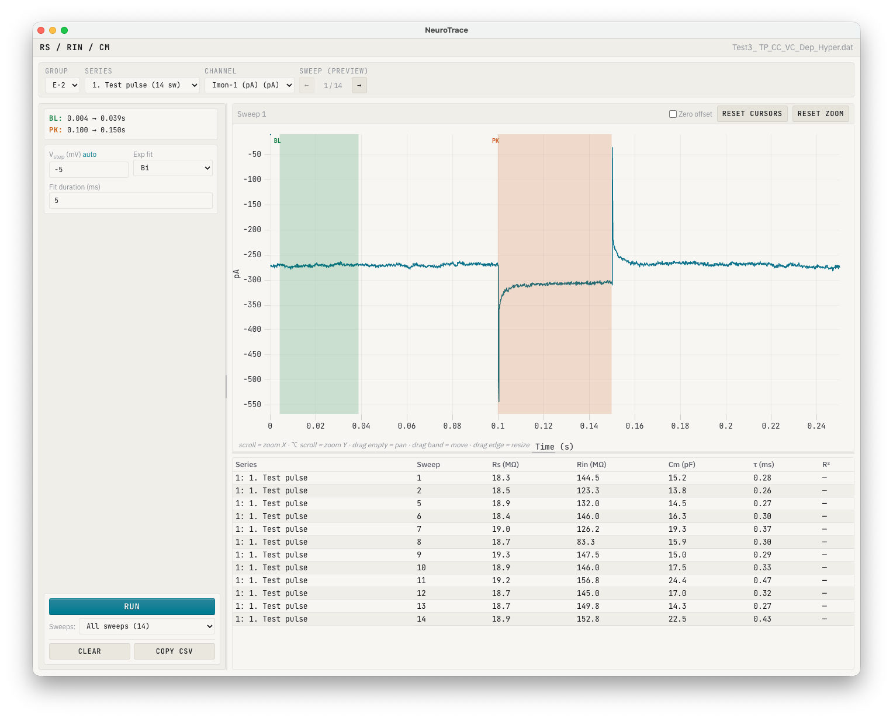

### The mini-viewer and cursors

Resistance uses two cursor pairs:

| Pair | Colour | Purpose |
|---|---|---|
| **Baseline** | green | The pre-pulse window, used to compute the resting current |
| **Peak / pulse** | yellow | The window containing the test pulse, from its onset to its end |

Unlike Cursor Measurements, there is no separate **fit** cursor:
the fit window is taken automatically from the peak of the
capacitive transient onward, with its length set by the **Fit
duration** parameter described below. This keeps the workflow
simple — you mark where the pulse is, TRACER finds the
transient inside it.

Cursor positions are shown read-only at the top of the left panel
in the format `BL: 0.001 → 0.010 s` and `PK: 0.010 → 0.050 s`. To
move a cursor, **drag it on the mini-viewer**: drag a band's
interior to translate, drag an edge to resize. The numerical
read-outs update in real time.

The mini-viewer header carries the same three controls you saw in
chapter 9 — **Zero offset**, **Reset cursors**, **Reset zoom** —
plus a small purple indicator that lights up when a fit is
displayed (e.g. *Fit (mono-exp, 5.0 ms)*). The fit curve itself is
overlaid on the trace in purple.

### Fit parameters

Three parameters drive the analysis.

- **V_step (mV)** — the amplitude of the test-pulse command, used
  as the numerator in the Rs and Rin formulae below. When a HEKA
  `.pgf` is available for the recording, this field is filled in
  automatically and labelled *auto*. You can override the value at
  any time by typing a different number — useful for files where
  the protocol metadata is missing or wrong, or for ABF files where
  no `.pgf` exists.

- **Exp fit** — *Mono* (single exponential) or *Bi* (sum of two
  exponentials). The single exponential is the right choice for
  most well-clamped cells; bi-exponential is offered for cases
  where the capacitive transient genuinely shows two distinguishable
  time constants — typically a small fast component dominated by
  Rs and a slower component reflecting the dendritic charge
  distribution.

- **Fit duration (ms)** — the length of the window over which the
  exponential is fitted, measured **from the peak of the
  transient**. Anywhere from 0.5 to 50 ms; the default of about
  5 ms is appropriate for most patch-clamp transients.

### Run controls

The Run controls at the bottom of the left panel work as in chapter
9, with one extra mode tailored to monitoring workflows:

- **All sweeps (N)** — every sweep in the series, minus exclusions.
- **Selected (N)** — only the sweeps currently selected in the
  Tree Navigator. Useful for analysing only the test pulses you
  trust, or only those flanking a drug application.
- **Averaged range** — averages a contiguous range of sweeps first,
  then runs the analysis once on the resulting average. Reduces
  noise at the cost of replacing per-sweep results with a single
  row labelled *avg X–Y*.
- **Single sweep** — one sweep, picked by index.

The **Run** button executes the chosen mode; **Clear** wipes the
results for the current series; **Copy CSV** places the entire
current results table on the clipboard as comma-separated values,
ready to paste into a spreadsheet.

If a run fails — typically because the pulse window is too short
for a fit, or because the optimiser does not converge — an inline
error banner explains why.

### How the numbers are computed

All four output quantities come from the same backend pass over a
single sweep (or averaged sweep). The procedure is:

**Step 1 — Baseline.** The current is averaged over the baseline
cursor window. This single number is then subtracted from
everything that follows.

**Step 2 — Peak transient.** Within the first 5 ms of the peak
window (or the first half of the peak window, whichever is
shorter), the sample with the largest absolute deviation from the
baseline is taken as the *peak current* of the capacitive
transient. The sign is preserved — for a depolarising VC step the
peak is positive, for a hyperpolarising step it is negative — but
the formulas below use absolute values so direction doesn't matter.

**Step 3 — Steady state.** The current is averaged over the last
20 % of the peak window — the assumption being that, by then, the
capacitive transient has decayed and what is left is the
steady-state response to the command.

**Step 4 — Rs and Rin.** Both are then straightforward applications
of Ohm's law:

> **Rs** *(MΩ)* = |V_step| / |peak current|
>
> **Rin** *(MΩ)* = |V_step| / |steady-state current|

Both numbers are converted to megohms internally (mV / pA gives
gigohms; the factor of 1000 in the code applies the unit
conversion). If either current is essentially zero — below
10⁻¹⁰ A in the code — the corresponding resistance is reported as
blank rather than as a divide-by-zero.

**Step 5 — Decay fit.** Starting from the peak sample, the fit
window of length **Fit duration** is taken. The samples in that
window are baseline-subtracted and the chosen exponential model is
fitted by non-linear least squares (SciPy's `curve_fit`, capped at
10 000 function evaluations).

For the **monoexponential**, the model is:

> *I(t) = a · exp(−t/τ) + offset*

with the time constant τ bounded between 0.01 ms and 0.9 × Fit
duration so that the optimiser cannot run away to physically
implausible values.

For the **biexponential**, the model is:

> *I(t) = a₁ · exp(−t/τ₁) + a₂ · exp(−t/τ₂) + offset*

with the same per-τ bounds. After convergence, the two components
are sorted so that τ₁ < τ₂ (fast first, slow second). The single τ
reported in the results is the **amplitude-weighted average** of
the two:

> *τ = (|a₁| · τ₁ + |a₂| · τ₂) / (|a₁| + |a₂|)*

This collapses the biexponential back into a single number that
slots into the Cm formula below.

The fit's quality is reported as **R²** computed from the
residuals against the variance of the data in the fit window.
Values close to 1 mean the fit explains most of the variance;
values near zero or negative mean it does not. R² is clamped at
zero so a pathologically bad fit can never drag the column into
the negatives.

**Step 6 — Cm.** Membrane capacitance is recovered from the time
constant and Rs by treating the cell as a simple RC circuit
charging through Rs:

> **Cm** *(pF)* = τ / Rs

with units arranged so that τ in ms divided by Rs in MΩ gives Cm
in pF directly. The formula approximates the full *Cm = τ × (Rs +
Rin) / (Rs · Rin)* by neglecting the contribution of Rin, which is
acceptable when Rin ≫ Rs — typical for healthy cells. For cells
where the input resistance is low (sick cells, leaky seals), the
reported Cm should be treated as approximate.

TRACER also applies a sanity filter: any computed Cm outside
the range 0.1 pF to 2 000 pF is dropped from the row rather than
displayed, on the grounds that anything outside that window is
overwhelmingly more likely to be a fit artefact than a real
measurement.

### The results table

Each run appends rows to the table; the table is not cleared
between runs against the same series, so you can incrementally
build up a record by running different sweep ranges with different
fit settings if you want to. The columns, in order, are:

- **Series** — the series name (truncated if long; hover for full).
- **Sweep** — the sweep index, 1-based, or *avg X–Y* for averaged
  ranges.
- **Rs** (MΩ), 1 decimal.
- **Rin** (MΩ), 1 decimal.
- **Cm** (pF), 1 decimal, blank if outside the sanity range.
- **τ** (ms), 2 decimals, blank if the fit did not converge.
- **R²**, 3 decimals, blank if the fit did not converge.

Selection and copying follow the table conventions from chapter 8
— click for single, shift-click for ranges, ⌘ / Ctrl-click for
additive — and right-click any row to copy it as TSV. **Copy CSV**
on the left panel exports every row in the current table at once.

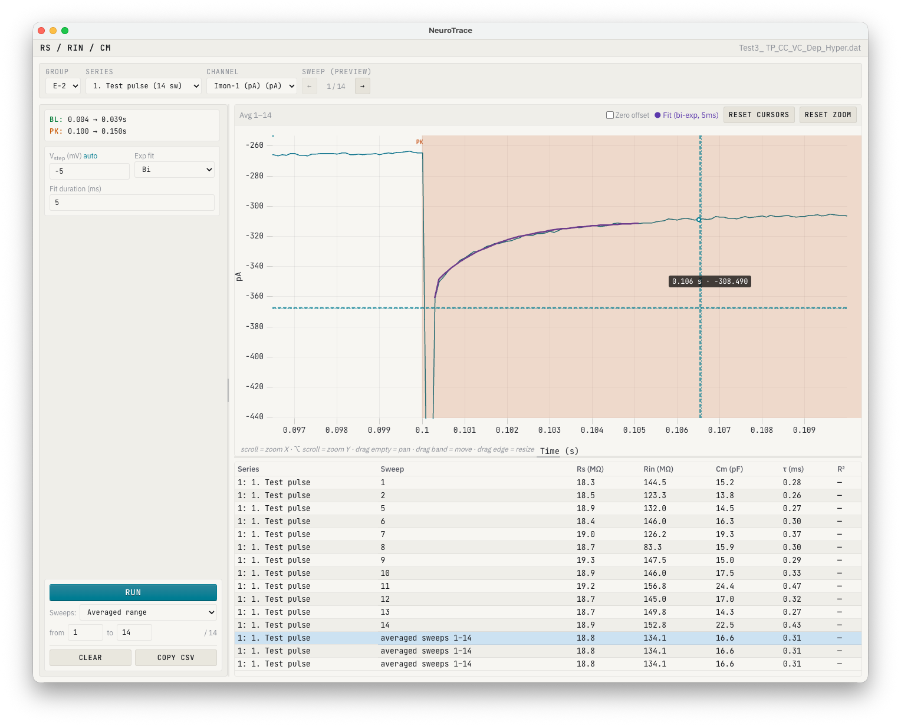

A summary timecourse plot — Rs / Rin / Cm over the sweep axis — is
not currently part of the window; results live only in the table.
For a quick visual scan, copy the table into a spreadsheet and plot
from there.

### Persistence

Resistance results are saved per *(group, series)* pair and stored
in the recording's sidecar, alongside the form parameters
(V_step, exponential mode, fit duration, run mode). The window's
own UI preferences — left-panel width, mini-viewer height — live
in the global preferences file. Reopening a recording restores
both, so you come back to the same view with the same numbers
already in place.

---

## 11. I-V Curve

The **I-V Curve** window plots a cell's response amplitude against
the level of injected stimulus, sweep by sweep, and fits a line
through the result. The slope of that line is the cell's **input
resistance** (or its conductance, depending on which axis you read
the line off), and the X-intercept is the **reversal potential** of
the underlying current. Per-sweep entries also expose two summary
numbers — **sag amplitude** and **sag ratio** — that quantify the
slow re-equilibration after a hyperpolarising step, useful for
characterising HCN-mediated Iₕ.

The window supports both modes of recording symmetrically:

- In **voltage clamp**, the stimulus is in mV and the response is
  in pA. The slope of the I-V line is then a conductance (pA / mV
  → nS); its inverse, scaled to MΩ, is the input resistance.
- In **current clamp**, the stimulus is in pA and the response is
  in mV. The slope is now a resistance directly; multiplied by the
  unit factor it is reported in MΩ as input resistance.

In either case TRACER works out the directionality from the
units of the recorded channel, so you do not have to tell it which
mode the recording is in.

### When to use this window

- Estimating input resistance from a step or ramp protocol.
- Locating the reversal potential of a synaptic or evoked current
  by extrapolating the I-V line to where it crosses zero.
- Quantifying sag during hyperpolarising current injection (the
  classic HCN signature).
- Comparing I-V relationships before and after a manipulation by
  running the analysis on two series and inspecting the two curves
  side by side in the results table.

*Reach this window from the toolbar's **Analyses ▾** menu, or
press `⌘K` and type **i-v** (or **iv**, **reversal**).*

### Window layout

The structural pattern is identical to **Resistance**: top selector
bar with sweep preview, left parameter pane, vertical splitter,
right pane split horizontally into mini-viewer above results.
What is new is the I-V curve plot itself — a scatter plot of stim
vs response with the linear-fit line overlaid — accessible through
a tab strip in the results panel.

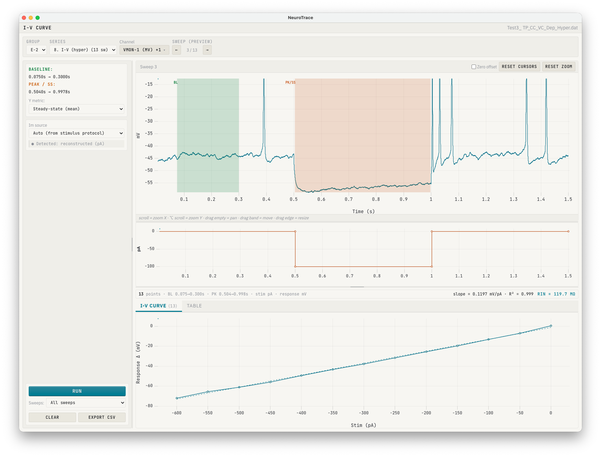

### The mini-viewer and cursors

I-V uses two cursor pairs, sharing the same window for two different
measurements:

| Pair | Colour | Purpose |
|---|---|---|
| **Baseline** | green | The pre-stimulus window from which the resting current (or voltage) is measured |
| **Peak / SS** | yellow | The pulse window. The mean over this window gives the *steady-state* response; the most-deflected sample within it gives the *transient peak* |

Cursor positions are read-only at the top of the left panel; drag
the bands on the mini-viewer to move them. The mini-viewer header
carries the same controls as the other analysis windows — Zero
offset, Reset cursors (which positions Baseline at 5–20 % and
Peak/SS at 35–65 % of the visible range), and Reset zoom.

The stimulus trace, when the file carries one, is shown as an
overlay in its usual right-axis colour; turn it on from the channel
overlay selector at the top of the window if it is not already
visible.

### The response metric

A small dropdown on the left panel — labelled **Y metric** — picks
which of two computed responses is plotted on the I-V curve and
shown in the *Response* column of the table. The choice is purely
display-driven: both metrics are always computed and stored per
sweep, so you can switch between them after a run without
re-running.

- **Steady-state (mean)** — the mean of the trace over the Peak/SS
  window, baseline-subtracted. The default. Right for steady
  steps where the cell has settled into its asymptotic response.
- **Transient peak** — the sample within the Peak/SS window with
  the largest *signed* deviation from the baseline,
  baseline-subtracted. Right when you are interested in the
  fast-onset response (for example, the peak of a synaptic current
  before desensitisation).

### Stimulus level: auto and manual

Each sweep in an I-V protocol carries a different level of
injected stimulus, and the analysis needs to know what that level
is to plot it against the response. TRACER offers two ways of
supplying it.

**Auto** — the default — reads the level out of the recording's
HEKA `.pgf` protocol file. TRACER picks the channel most
likely to be the actual command (heuristically, the one with the
largest range and an active *do-write* flag) and, for each sweep,
uses the most-deflected segment value of that channel as the
stimulus level. Volts are converted to millivolts and amperes to
picoamperes automatically. After a successful run, the panel
reports back what it detected — for example,
*Detected: reconstructed (mV)*.

**Manual** is the fallback for ABF files, plain-text imports, or
HEKA recordings whose protocol metadata is missing. Pick **Manual
(start / step)** and fill in four fields:

- **start (s)** — the time at which the stimulus turns on.
- **end (s)** — the time at which it turns off.
- **start Im (pA)** — the stimulus level of the *first* sweep in
  the analysis range.
- **step (pA)** — the increment per sweep, so that the level for
  sweep *n* is *start + n × step*.

The window shows the formula as a small caption under the inputs to
make the convention explicit. Negative values and zero steps are
allowed; TRACER uses whatever you supply.

If you leave the window in Auto on a recording that does not have
a usable stimulus, the run aborts with a clear message asking you
to switch to Manual.

### Run controls

The same All / Range / Single / *averaged range* dispatch you saw
in chapter 10. Two I-V-specific behaviours are worth flagging:

- The results are **sorted by stimulus level** before being plotted,
  so the curve always reads left-to-right in stim order regardless
  of how the protocol was actually run.
- **Single sweep** mode *appends* to the existing table rather than
  replacing it, the way it does in Resistance. This is intentional:
  it lets you cherry-pick individual sweeps onto the same I-V
  curve, which is useful when a protocol contains both monotonic
  and outlier steps.

**Run** executes; **Clear** removes the entry for the current
*(group, series)* pair; **Export CSV** writes the entire
collection of I-V results across every analysed series in the
recording to a single CSV file.

### How the numbers are computed

For each sweep in the run set, the backend extracts five quantities
from the trace:

- **Baseline** = mean over the baseline window.
- **Steady-state** = mean over the Peak/SS window.
- **Transient peak** = the sample within the Peak/SS window whose
  absolute deviation from the baseline is largest. The sign is
  preserved.
- **Sag amplitude** = transient peak − steady-state. With the
  signs preserved, the result is positive when the trace transiently
  *exceeds* its steady-state response and negative otherwise — the
  classic depolarising sag during a hyperpolarising step comes out
  as a positive number under VC and a negative number under CC,
  which simply reflects the unit conventions of the two modes.
- **Sag ratio** = sag amplitude divided by (transient peak −
  baseline), reported only when the denominator is non-zero. A
  dimensionless number that allows comparison across cells of
  different sizes; commonly used as the headline number for
  Iₕ-mediated sag.

Each row in the table carries all five (plus the **Response**
column, which is whichever of *steady* or *peak* you have
currently selected as the Y metric, baseline-subtracted).

### The I-V line

Once at least two points are present, TRACER fits a straight
line through them using ordinary least-squares linear regression.
The fit is computed client-side directly from the per-sweep table,
so switching the Y metric immediately re-fits without going back
to the backend.

What the fit reports:

- **Slope** — the slope of the line in *response-units per
  stim-units*. Reported as part of the summary line above the I-V
  plot.
- **R²** — the goodness of fit, on the standard 0–1 scale.
- **Input resistance (Rin)** — the slope, scaled into megohms with
  the right sign for the recording mode:
  - In voltage clamp (stim mV, response pA), *Rin = 1000 / slope*
    MΩ.
  - In current clamp (stim pA, response mV), *Rin = slope × 1000*
    MΩ.
  - For other unit combinations the field is left blank, since
    there is no unambiguous resistance interpretation.
- **Reversal potential** — the X-intercept of the line, read off
  the plot directly. The Y axis on the I-V plot is forced to
  include zero so that the crossing is always visible.

### The results panel

Two tabs sit at the top of the results panel.

The **I-V curve** tab is the scatter plot, with the linear-fit
line drawn through the points as a dashed accent-coloured line.
Click a point to highlight it; the corresponding row in the table
is highlighted in the same colour. (Selecting a point or row does
not jump the main viewer to that sweep — use the sweep preview
arrows on the top bar for navigation.)

The **Table** tab shows every per-sweep row with the columns
**Sweep · Stim · Baseline · Steady-state · Transient peak · Sag
amp · Sag ratio · Response**. The Sweep column is 1-based; the
unit headings update with the recording's units. Selection,
shift-click, ⌘ / Ctrl-click, right-click-to-copy-as-TSV all work
as in chapter 8.

A summary line above both tabs reports the point count, the
cursor windows used for the run, and (when a fit is present) the
slope, R² and input resistance.

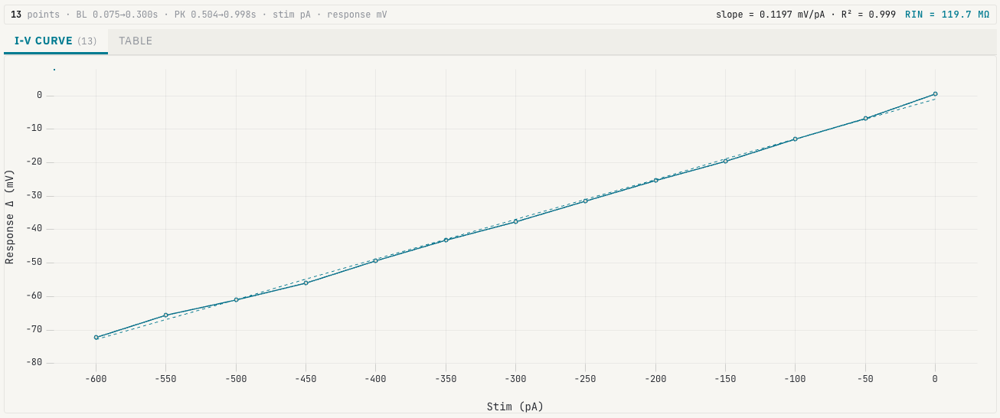

### Persistence

I-V results, the form parameters (run mode, sweep range, Y
metric, manual-Im fields, detected stimulus source), and the
selected point are stored per *(group, series)* pair in the
sidecar. The window's left-panel width and mini-viewer height
live in the global preferences file. Reopening a recording
restores everything, including which metric you had selected and
which point you had highlighted on the curve.

---

## 12. Action Potentials

The **Action Potentials** window is the largest analysis module in
TRACER, and the natural reach for any current-clamp recording
where individual spikes matter. It detects spikes, counts them,
turns them into firing-rate and frequency-adaptation summaries,
fits per-spike kinetics (threshold, amplitude, rise, decay,
half-width, fast and medium afterhyperpolarisations, peak slopes),
and draws phase-plane loops for chosen spikes — all from the same
backend pass over a chosen sweep set, all rerunnable any number of
times as you tune the parameters.

The window deliberately separates *counting* from *kinetics*: the
Counting tab is the lightweight pass for working out how many
spikes a cell fires at each level of injected current and what its
F–I curve looks like; the Kinetics tab is the more expensive pass
that adds per-spike measurements and the phase plot. You can
switch between the two tabs at any time without re-running, and
manual edits made in either tab — clicking to add a spike the
detector missed, or clicking to remove a spurious one — replay on
every subsequent run, so you do not lose them when you change a
threshold and try again.

In Stimfit terms, this window combines what *Spike count*, *AP
analysis*, and *F–I curve* would do, and adds an interactive
phase plot.

### When to use this window

- Counting spikes per sweep over a current-step protocol and
  drawing the F–I curve (firing rate against injected current).
- Estimating **rheobase** — the lowest current that triggers a
  spike — from a step protocol or a ramp.
- Measuring **per-spike kinetics**: threshold, amplitude, rise
  time, decay time, half-width, fAHP and mAHP amplitudes, and the
  steepest slopes of the rising and falling phases.
- Looking at the **phase plot** (Vm against dV/dt) for any chosen
  spike, including the multi-spike overlay that exposes
  accommodation across a train.
- Hand-correcting detector mistakes on a small fraction of sweeps
  — adding the occasional missed spike, removing the occasional
  artefact — without losing the work the detector did everywhere
  else.

For passive properties, use **Resistance** (chapter 10); for
voltage-clamp synaptic events, use **Event Detection** (chapter
13) or **Cursor Measurements** (chapter 9).

*Reach this window from the toolbar's **Analyses ▾** menu, or
press `⌘K` and type **action** (or **ap**, **spikes**).*

### Window layout

The window follows the same skeleton as the other analysis
chapters but with two tabs rather than the usual one results
panel.

The **top bar** carries the standard group, series, and channel
selectors followed by a sweep preview navigator (`←` / number /
`→`), with overlay toggles to bring in the stimulus or a secondary
channel for visual context.

The **tab strip** is just below the top bar and contains exactly
two tabs:

- **Counting** — per-sweep counts and rates, F–I curve, rheobase.
- **Kinetics** — per-spike measurements with a phase plot.

Below the tabs, the body is a left/right split. The **left panel**
holds the parameters: detection method and thresholds at the top,
filter, kinetics options (visible on the Kinetics tab), the
rheobase block (visible on the Counting tab), and a pinned
footer with the run mode and the **Run / Clear / Clear edits**
buttons. A vertical splitter lets you widen the panel.

The **right panel** is split horizontally. On the **Counting**
tab, the top half is a full-sweep mini-viewer with a draggable
analysis-bounds band overlaid; the bottom half is the per-sweep
table on one side and the F–I curve plus rheobase badge on the
other. On the **Kinetics** tab, the top half is a *spike* viewer
(zoomed around the currently selected peak, with all kinetic
markers drawn) on the left and a *phase plot* on the right; the
bottom half is the per-spike table.

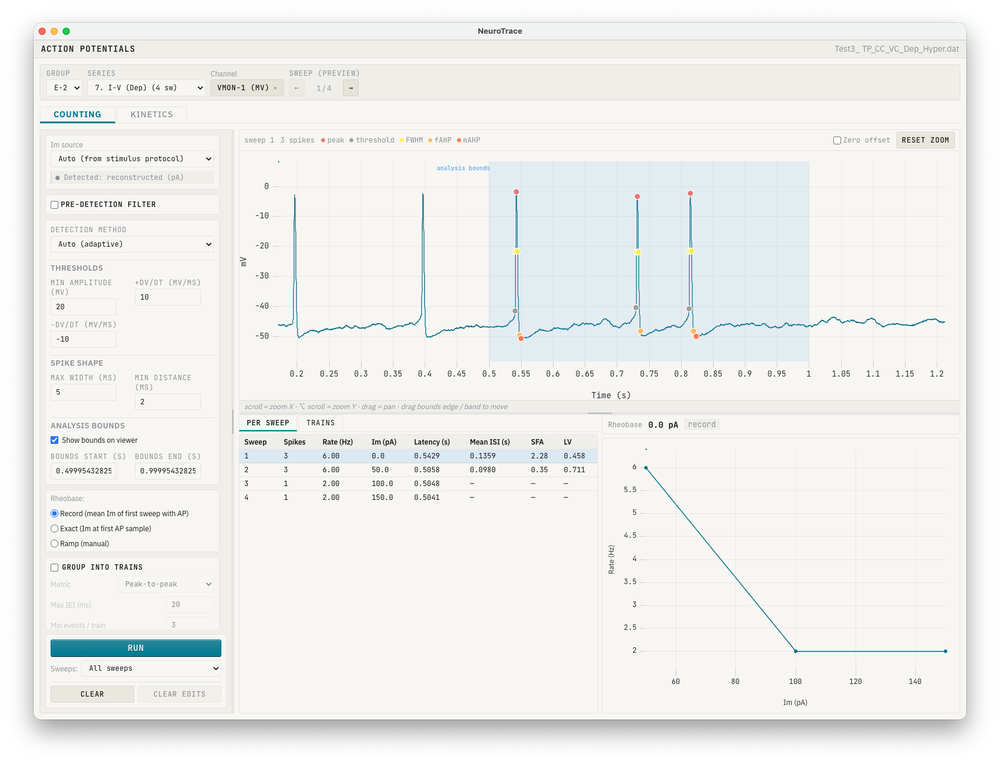

### The mini-viewers and the analysis bounds

Both mini-viewers carry the familiar header strip — **Zero
offset**, **Reset cursors**, **Reset zoom** — and respond to the
usual wheel and drag conventions described in chapter 4.

Unlike most other analysis windows, the AP window has **no
baseline / peak / fit cursor pairs**. Instead, detection is
constrained to a single **analysis bounds** band drawn over the
sweep. The band has the same draggable behaviour as a cursor pair
— grab an edge to resize, drag the interior to translate — and
its current values appear in the *Bounds start (s)* and *Bounds
end (s)* numeric inputs in the left panel. Setting **Bounds end**
to *0* means "use the full sweep". A small **Show bounds** toggle
in the left panel hides the band when you do not want it
distracting from the trace; the analysis still respects whatever
the inputs say.

On the **Counting** mini-viewer, the bounds band runs over the
whole sweep view. On the **Kinetics** spike viewer, the band is
not relevant — that view is zoomed to a single peak — so it is
hidden automatically.

### Choosing a detection method

The first decision is which of three detectors to run; the
**Detection method** dropdown picks one. The default is
`auto_rec`, which is appropriate for most well-clamped current-
clamp recordings.

- **Auto — single pass (`auto_spike`)** — opens a candidate
  whenever the first derivative dV/dt rises above the **+dV/dt
  threshold** in mV/ms; closes it when dV/dt drops back below
  the **−dV/dt threshold**, provided this happens within the
  configured **Max width**; takes the peak as the most depolarised
  sample between those two crossings. Candidates are then rejected
  if their amplitude (peak minus a local pre-peak baseline) is
  below the **Min amplitude** floor, and any pair of survivors
  closer than the **Min distance** is collapsed by keeping the
  taller one. A clean, fast detector that works very well when
  the spikes are uniform.

- **Auto — adaptive (`auto_rec`)** — runs the same first pass as
  *auto_spike*, then re-runs detection with an adaptive level
  threshold equal to the average of *median peak Vm* and *median
  threshold Vm* across the first-pass spikes. The second pass
  recovers smaller, accommodated late-train spikes that an
  amplitude floor tuned to the early ones would have missed. This
  is the default for current-clamp experiments where firing
  amplitude declines through the train.

- **Manual threshold (`manual`)** — opens a candidate at every
  upward crossing of the **Manual threshold (mV)** value, looks
  ahead for a downward crossing of the same threshold within
  **Max width** samples, and takes the peak in between. The
  amplitude and merge filters above still apply. Useful for cells
  with stable AP amplitude and a sharp foot, or for matching the
  conventions of another tool that defines spike onset by voltage
  crossing rather than by derivative.

### Detection parameters

The same set of parameters drives all three methods, except
**Manual threshold (mV)** which is shown only when *Manual* is
selected.

| Parameter | Default | What it controls |
|---|---|---|
| **Manual threshold (mV)** | −10 | Voltage crossing for the manual detector |
| **Min amplitude (mV)** | 50 | Reject candidates whose peak is less than this above the local pre-peak baseline |
| **+dV/dt (mV/ms)** | 10 | Rising-slope threshold to open a spike candidate |
| **−dV/dt (mV/ms)** | −10 | Falling-slope threshold to close a candidate |
| **Max width (ms)** | 5 | Maximum time from rising crossing to falling crossing; candidates that fail to close are rejected |
| **Min distance (ms)** | 2 | Two thresholds in one: surviving peaks closer than this are merged (taller wins), and a click-to-add only snaps to a local Vm maximum within ±half this window |
| **Bounds start (s)** | 0 | Inclusive start of the analysis window inside the sweep |
| **Bounds end (s)** | 0 | Exclusive end; *0* means "to the end of the sweep" |

A **Pre-detection filter** section exposes the same Butterworth
filter described in chapter 4 (lowpass / highpass / bandpass plus
order and cutoff(s)). Off by default. When on, the filtered trace
is what the detector and all subsequent kinetics measurements see;
the raw trace is still drawn beneath the filter overlay so you can
verify nothing important has been smoothed out.

### Run controls

The bottom of the left panel pins:

- **Run** — executes the analysis. The button shows *Running…*
  while the backend is working.
- **Clear** — discards the current results for this *(group,
  series)* pair (parameters are kept).
- **Clear edits** — resets the manual additions and removals back
  to empty without touching the rest of the form.

The **Run mode** dropdown picks the sweep set:

- **All sweeps** — every sweep in the series, minus exclusions.
- **Range** — a contiguous range, with from/to inputs displayed
  next to the dropdown.
- **Single sweep** — one sweep, picked by index.

The window does not currently expose a *Selected* mode that follows
the Tree Navigator's selection; if you want to analyse a hand-picked
subset, use **Range** or run multiple **Single sweep** passes.

If the run fails — invalid bounds, no spikes anywhere, missing Im
when rheobase is required — an inline red banner above the Run
button reports the problem with a *dismiss* button.

### The Counting tab

The Counting tab gives you the lightweight, per-sweep view of the
spike train.

#### The per-sweep table

Each detected sweep contributes one row. The columns are:

- **Sweep** — 1-based sweep index.
- **Spikes** — number of detected peaks inside the analysis
  bounds, manual edits applied.
- **Rate (Hz)** — spike count divided by the duration of the
  analysis bounds.
- **Im (pA)** — the mean stimulus current over the analysis
  bounds, used as the X coordinate of the F–I curve. The source —
  reconstructed from the protocol or supplied manually — is shown
  in a small caption above the curve.
- **Latency (s)** — time from the stimulus onset (read from the
  recording's `.pgf` protocol) to the first detected peak.
- **Mean ISI (s)** — the mean of the inter-spike intervals when
  there are at least two spikes.
- **SFA** — the **spike-frequency adaptation** ratio, computed as
  the *first* ISI divided by the *last* ISI. Values above 1
  indicate the cell slows down through the train (the typical
  pattern for adapting pyramidal neurones); values close to 1
  indicate a regular train; values below 1 indicate acceleration.
  Reported as blank when fewer than two ISIs exist.
- **LV** — the **local variance** of the inter-spike intervals,
  in the form proposed by Shinomoto and colleagues (2003):

  > LV = ⟨ 3 · (ISIᵢ − ISIᵢ₊₁)² / (ISIᵢ + ISIᵢ₊₁)² ⟩

  averaged across consecutive ISI pairs. LV is robust to slow
  rate changes through the train (a strength over the coefficient
  of variation), tracks specifically the pairwise irregularity,
  and tends towards 0 for highly regular firing, towards 1 for
  Poisson, and above 1 for bursty. Blank when fewer than two
  ISIs exist.

Click any row to jump the spike viewer to the spike that opens
that sweep; the corresponding F–I point is highlighted.

#### The F–I curve

The lower-right of the Counting tab shows the cell's F–I curve as
a scatter plot, one point per sweep, with the injected current on
the X axis and the firing rate on the Y axis. TRACER gets the
per-sweep current in one of two ways.

- **Auto** (default) — reads the stimulus channel reconstructed
  from the recording's `.pgf` protocol, and uses the mean of that
  channel over the analysis bounds as the per-sweep Im. The
  detected stimulus source is reported in a caption ("*Detected:
  reconstructed (pA)*"); when no usable protocol is found the
  caption reads "*F-I curve needs an Im channel — pick one above
  and re-run.*" and the curve panel stays empty.

- **Manual** — for ABF files or recordings whose protocol is
  missing, tick **Manual Im** in the left panel and supply
  *start (s)*, *end (s)*, *start (pA)* and *step (pA)* fields.
  Sweep *n* is then assumed to carry an Im of *start_pA + n ×
  step_pA*, constant across the supplied window and zero outside.

Clicking a point on the F–I curve jumps the spike viewer to the
first AP of that sweep.

#### Rheobase

A small **rheobase** badge sits above the F–I plot. Three modes
choose how it is computed:

- **First-firing sweep (`record`)** — the mean Im of the first
  sweep that fires at least one spike. The simplest and most
  robust estimate; the right default for stepped current-injection
  protocols.
- **Exact (`exact`)** — the value of the Im channel at the exact
  sample of the first AP's peak, baseline-corrected by subtracting
  the median of the first 100 ms of the analysis bounds. Requires
  an Im channel; resolves the step level more precisely than
  *record* when the protocol carries a smooth ramp inside the
  step.
- **Ramp (`ramp`)** — for ramp protocols, TRACER linearly
  interpolates between *start Im* and *end Im* over the *start*-to-
  *end* time window, evaluating at the time of the first AP's
  peak. The **Auto-fill** button next to the ramp fields parses
  the recording's protocol file and pre-populates the four numbers
  when a ramp segment is found; *Step* and *None* outcomes are
  reported back so you know what was detected.

The selected mode and any ramp parameters are saved with the
analysis and restored on reopening.

### The Kinetics tab

The Kinetics tab is where the per-spike measurements live, and
where you do all the fine-tuning of how the threshold, the rise,
the decay, and the AHPs are detected on each spike.

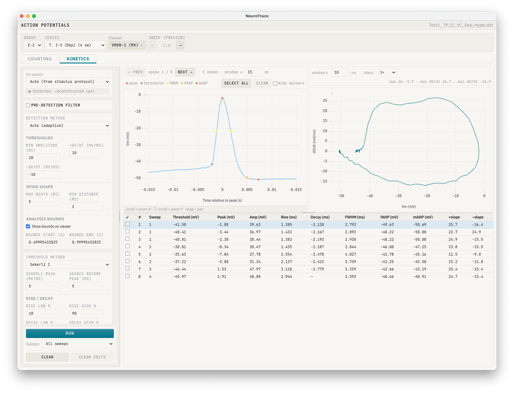

#### Choosing a threshold method

The single most important parameter on this tab is the **Threshold
method** — how TRACER decides where the AP threshold is on
each spike. Eight methods are offered, grouped by family.

| Method | Selector | What it computes |
|---|---|---|
| **First-deriv cutoff** | `first_deriv_cutoff` | First sample in the search window where dV/dt rises above **Cutoff (mV/ms)** |
| **First-deriv max** | `first_deriv_max` | Sample with the largest dV/dt in the search window |
| **Third-deriv cutoff** | `third_deriv_cutoff` | First sample where the third derivative d³V/dt³ rises above the cutoff (third derivative computed by two further `np.gradient` passes, scaled by the appropriate `(sr/1000)²` factor) |
| **Third-deriv max** | `third_deriv_max` | Sample with the largest d³V/dt³ |
| **Sekerli I** | `sekerli_I` | argmax of *d²V / dV* (Sekerli et al. 2004), masked to samples where dV/dt exceeds **Sekerli mask (mV/ms)** to avoid divide-by-near-zero behaviour |
| **Sekerli II** | `sekerli_II` | argmax of *(d³V·dV − d²V²) / dV³* (Sekerli et al. 2004), with the same lower-bound mask |
| **Leading inflection** | `leading_inflection` | argmin of dV/dt in the search window — i.e. the most negatively-sloped sample at the foot of the spike |
| **Max curvature** | `max_curvature` | argmax of κ = d²V / (1 + (dV/dt)²)^(3/2) (Rossokhin & Saakian 1992) |

The right method is partly a matter of taste and partly a matter
of what the cell does. **First-deriv cutoff** is robust and
intuitive when spikes are uniform; **third-deriv** variants pick
the inflection point cleanly when first-derivative noise is high;
**Sekerli I/II** are the more principled measures when accommodation
makes the simple cutoff arbitrary; **max curvature** is geometric
and tends to be the most consistent across spikes of varying
amplitude.

#### Other kinetics parameters

Around the threshold method, a small set of parameters controls
the rest of the per-spike measurement.

| Parameter | Default | Purpose |
|---|---|---|
| **Cutoff (mV/ms)** | 20 | Threshold value for the cutoff methods (`first_deriv_cutoff`, `third_deriv_cutoff`) |
| **Search before peak (ms)** | 5 | Width of the look-back window in which the threshold method is evaluated |
| **Sekerli mask (mV/ms)** | 5 | Masks out samples where dV/dt is below this in the Sekerli ratios, avoiding divisions by near-zero |
| **Rise low %** / **Rise high %** | 10 / 90 | Crossings of the rise that bracket the rise-time measurement |
| **Decay low %** / **Decay high %** | 10 / 90 | Crossings of the decay that bracket the decay-time measurement |
| **Decay end** | *to_threshold* | Whether the decay percentages refer to the trace returning *to threshold* or *to the fAHP minimum* |
| **fAHP start / end (ms)** | 0 / 5 | Window after the peak in which the **fast AHP** minimum is searched |
| **mAHP start / end (ms)** | 5 / 100 | Window after the peak in which the **medium AHP** minimum is searched |
| **Max-slope window (ms)** | 0.5 | Sliding window over which dV/dt is averaged before taking max(|·|) for the **+slope** and **−slope** outputs |
| **Interp to 200 kHz** | on | Resamples the rise and decay segments to 200 kHz with linear interpolation before measuring percentage-crossing times; the slopes themselves remain on the original sampling grid |

The interpolation is purely for *time-of-crossing* refinement —
it gives sub-sample-rate resolution on the rise and decay times
without altering the underlying signal. Slopes, peak Vm, AHP
amplitudes, and threshold are all measured on the original signal.

#### The per-spike table

The Kinetics table has one row per detected (or manually added)
spike. Columns:

- **#** — spike index within the run; manual spikes are marked
  with a leading ★.
- **Sweep** — 1-based sweep index.
- **Threshold (mV)** — Vm at the threshold sample chosen by the
  selected method.
- **Peak (mV)** — Vm at the peak sample.
- **Amplitude (mV)** — peak minus threshold.
- **Rise (ms)** — time from the *Rise low %* crossing to the
  *Rise high %* crossing.
- **Decay (ms)** — time from the *Decay high %* crossing on the
  decay phase down to the *Decay low %* crossing, with the
  amplitude reference set by **Decay end**.
- **FWHM (ms)** — half-width at 50 % of (peak − threshold).
- **fAHP (mV)** — minimum Vm in the fAHP search window, expressed
  as Vm directly (not as the fAHP amplitude relative to threshold).
- **mAHP (mV)** — minimum Vm in the mAHP search window.
- **+slope (mV/ms)** — maximum smoothed dV/dt on the rising phase.
- **−slope (mV/ms)** — minimum smoothed dV/dt on the falling phase.

A checkbox column on the left lets you select a subset of rows;
the **Phase plot** (next section) draws an overlay loop for every
selected spike. Clicking a row also navigates the spike viewer to
that spike. Right-click a row for **Copy as TSV**, or shift-click
multiple rows and copy them in one go.

When fewer than four samples are available between the threshold
and either rise crossing — typically because a spike is too brief
for the requested percentages — the affected cell in that row is
left blank rather than reported as a poorly-resolved number.

#### The phase plot

The right pane of the Kinetics tab is the **phase plot**: Vm on
the X axis, dV/dt on the Y axis, drawn as a closed loop for the
currently selected spike (or as several overlaid loops if more
than one spike is selected via the table checkboxes).

A small header above the plot exposes:

- **Window ±** — half-width of the time window around the peak,
  in milliseconds. Default 10 ms; widen it to see more of the
  fAHP, narrow it to focus on the spike itself.
- **Interp** — upsampling factor (1× / 10× / 50× / 100×). The
  selected window is upsampled by linear interpolation
  (`np.interp` — not a cubic spline) and dV/dt is recomputed on
  the upsampled grid. Higher factors smooth the loop's appearance
  at the cost of producing more samples than the original
  recording justifies.
- **Metrics** — three summary numbers: max Vm, max dV/dt, and
  min dV/dt. Displayed as a one-line caption.

Spike navigation (←, ☓, →) lives in the spike viewer's header
above the phase plot, and steps through the per-spike table one
row at a time.

The phase plot does not draw a horizontal line at the cutoff
threshold; the *Cutoff (mV/ms)* parameter governs the *first-deriv
cutoff* threshold method, but no graphical hint of it appears on
the loop.

### Manual spike editing

Even the best detector mishandles the occasional spike, and the
AP window's main quality-of-life feature is that you can fix those
without re-running everything. The pattern is the same as in the
Burst, Event and Paired windows.

- **Adding a spike** — left-click on the spike viewer at the time
  you want a peak. TRACER snaps to the nearest local Vm
  maximum within ±*Min distance / 2* and adds a spike there. If
  the click is closer to an existing spike than *Min distance*,
  it is rejected (you cannot accidentally double up).
- **Removing a spike** — right-click on a spike marker. The marker
  enters a *primed* state, drawn with a confirmation ring; click
  again on the same marker to confirm the removal. Any
  auto-detected spike within ±*Min distance* of the click is
  dropped.

Manual edits are stored as a structured set of additions and
removals keyed by sweep index, so they survive when you change a
detection threshold and re-run. After every Run, the detector
runs first on the fresh parameters; then the recorded *removals*
drop spikes the detector picked up; then the recorded *additions*
are inserted. Each output spike carries a `manual` flag, which is
what drives the ★ prefix in the kinetics table and the outer ring
on the spike marker.

The **Clear edits** button on the run footer clears every recorded
addition and removal in one go, returning the run to "what the
detector said".

### Persistence

AP results, the form parameters (detection method and thresholds,
kinetics options, rheobase mode and ramp parameters, manual-Im
fields, run mode and sweep range), and the per-series manual
edits are stored per *(group, series)* pair in the recording's
sidecar. The window's left-panel width, splitter height, and
*Show bounds* state live in the global preferences file. Reopening
the recording brings the window back exactly as you left it: the
same parameters, the same detected spikes, the same manual
additions and removals, and the same row highlighted in the
kinetics table.

---

## 13. Event Detection

The **Event Detection** module is TRACER's workflow for
spontaneous synaptic events: miniature EPSCs and IPSCs,
spontaneous postsynaptic currents, and any other repetitive
short-lived deflection that appears without an explicit trigger.
It runs three different detection algorithms — a simple amplitude
threshold and two template-based methods — over a chosen sweep set,
fits per-event kinetics on every detected event, and gives you
several windows to inspect, curate, and refine the result.

The Events workflow uses **four cooperating windows**, each opened
in its own desktop window:

- the **Event Detection** window, where the parameters live and
  detection is run;
- the **Events Browser**, for stepping through detected events
  one at a time and reviewing kinetics on a zoomed view;
- the **Template Generator**, for building a biexponential
  detection template by hand against a representative event;
- the **Template Refinement** window, for averaging the events you
  have already detected and re-fitting the template to that
  average so the next pass is sharper.

You reach the **Event Detection** window from the toolbar's
Analyses menu; the other three are sub-launched from buttons inside
it.

*Reach this window from the toolbar's **Analyses ▾** menu, or
press `⌘K` and type **events** (or **mini**, **mEPSC**).*

### When to use this window

- Detecting and characterising mEPSCs / mIPSCs in long
  spontaneous recordings.
- Counting evoked synaptic events in repetitive stimulus
  protocols where the template is well-defined.
- Curating a noisy detection by accepting / rejecting events
  individually before computing a summary.
- Building a recording-specific template when the off-the-shelf
  parameters miss the kinetics of your particular preparation.

### The detection workflow

The typical workflow is:

1. **Open the Event Detection window**. Pick the channel, the
   bounds, the pre-detection filter, and a detection method.
2. **Run a first pass.** Inspect the detected events on the trace.
3. **Open the Events Browser** to step through each event with
   its kinetics laid out alongside.
4. **Refine the template** if the default is missing real events
   or picking up noise. Either build one from scratch in the
   Template Generator, or average the current detections in the
   Template Refinement window.
5. **Re-run** with the refined template. Iterate until the
   detection is good enough.
6. **Curate** by accepting / rejecting individual events in the
   Browser; manual additions and removals are remembered and
   replayed on every subsequent run.

### The Event Detection window — layout

The window follows the now-familiar shape: a top bar with group /
series / channel / sweep selectors, a left parameter panel
(scrollable), a central trace viewer that fills the rest of the
space, and a footer with the **Run** button (which doubles as a
progress bar, filling left-to-right as detection progresses).

Underneath the trace, when detection has run, an optional
**detection-measure subplot** shows the auxiliary signal that the
chosen method actually thresholded — the sliding correlation for
the correlation method, the deconvolved amplitude trace for
deconvolution. A horizontal line shows the cutoff used, so you
can read off how comfortably each event clears it.

Detected events are drawn on the trace as small markers at each
peak; manual edits and curation groups colour them differently
(see *Manual edits* below).

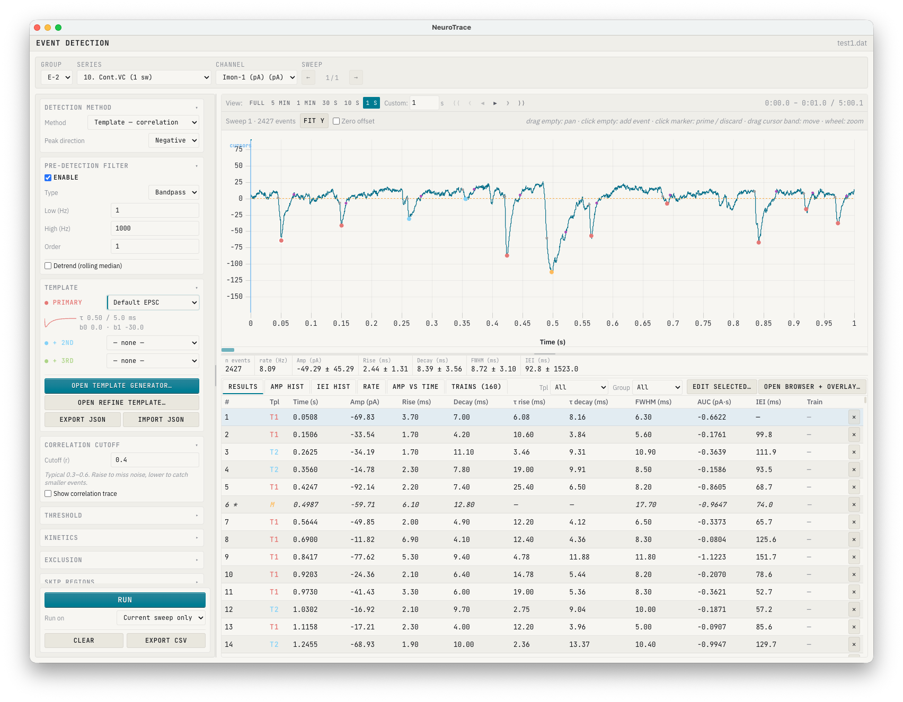

### Choosing a detection method

The **Method** dropdown picks one of three detectors.

#### Threshold (`threshold`)

The simplest path: a fixed amplitude crosses a user-set value and
the most-extreme sample in the resulting region is the event peak.
You pick a **threshold value** in the recording's units (pA or mV),
a **direction** — *negative* for inward currents and IPSPs,
*positive* for outward currents and EPSPs — and a **minimum
inter-event interval** in milliseconds.

Use this method when your events are clean, large, and uniform —
typically optogenetically- or electrically-evoked responses with
a stable baseline.

#### Template — correlation (`template_correlation`)

Slides a biexponential template across the signal and accepts
windows where the Pearson correlation coefficient between the
data and the template is above a cutoff (Clements & Bekkers
1997; Jonas et al. 1993). You set:

- a **cutoff** *r*-value (default 0.4) — higher values are
  stricter;
- the **template** itself (the active template from the library;
  see the Template Generator below);
- the **direction** (auto / positive / negative).

After accepted windows are picked, each candidate is refined to
the data-space extremum within a window of the template's
characteristic width, so the reported peak time is on the actual
trace — not on the smoothed correlation curve.

This is the right default for most miniature recordings: it is
robust to drifting baselines and, with a good template, picks up
events that an amplitude threshold buried in noise would miss.

#### Template — deconvolution (`template_deconvolution`)

Pernía-Andrade et al. (2012). Performs a Fourier-domain
deconvolution of the data by the template, bandpass-filters the
result, and fits a Gaussian to the histogram of the deconvolved
amplitudes; the cutoff is then placed at *cutoff_sd · σ* of that
Gaussian. You set:

- a **cutoff** in standard deviations (default 3.5);
- the **bandpass** for the deconvolved trace (`deconv_low_hz`,
  `deconv_high_hz`);
- the **template** and the **direction**.

The histogram-fit cutoff makes this method effectively
self-calibrating to the noise floor of each recording, which is
why it is often the first thing to try on noisy data where a
fixed correlation-r cutoff is too stiff.

### Detection parameters and pre-detection processing

Above the method, three pre-detection blocks shape the signal
*before* the detector sees it.

- **Pre-detection filter** — the same Butterworth shape as the
  main viewer (lowpass / highpass / bandpass, plus order, plus
  cutoffs). Off by default; turn it on if your recording has
  obvious noise that competes with real events.
- **Detrend** — a rolling-median high-pass intended to remove
  slow drift without distorting the events themselves. Off by
  default; the rolling window is in milliseconds (default 500 ms).
- **Skip regions** — up to five time intervals that the detector
  will ignore. Useful when you have stim artefacts or movement
  artefacts you do not want detected as events.

Below the method, the **Bounds** start and end inputs limit
detection to a portion of each sweep.

### Per-event kinetics

Once events have been picked, TRACER measures a standard set
of kinetics on each one. Every detected and every manually-added
event carries these fields:

- **peak time / value** — sample time in seconds and the signed
  voltage / current at the peak.
- **foot** — the local baseline anchor, typically the inflection
  point on the rising edge.
- **baseline** — the mean signal in a small window before the
  foot.
- **amplitude** — peak − baseline, signed.
- **rise time** — time between configurable percentage crossings
  on the rising phase (10 % – 90 % by default).
- **decay time** — time from peak to the configured decay
  endpoint (e.g. first crossing of 37 % of the amplitude back
  toward baseline).
- **half-width** — full-width at half-amplitude.
- **AUC** — trapezoidal integral from foot to decay endpoint.
- **monoexponential τ** — fit to the decay phase as
  *baseline + a · exp(−t/τ)*.
- **per-event biexponential fit** — `b0`, `b1`, `τ_rise`,
  `τ_decay`, and *R²* of a fit of the same biexponential the
  templates use. The R² is what the **min biexp R²** exclusion
  filter tests against.

Each event also carries a `manual` flag (set when you added it by
hand) and an optional **template index** when more than one
template was active.

### Exclusion filters

Below the kinetics block, a set of optional filters drops events
that match certain criteria. Filters are evaluated *after*
kinetics have been measured, so an excluded event can still be
seen in the browser if you turn the filter off temporarily.

- **Amplitude min / max** — absolute amplitude band in the
  recording's units (defaults 5 to 2000).
- **Min IEI (ms)** — collapse events closer than this together,
  keeping the larger.
- **Min biexp R²** — drops events whose biexponential fit did not
  converge well; useful to remove noise hits that survived the
  template match.
- **Max rise / decay / FWHM (ms)**, **min AUC** — secondary
  shape filters; off by default.

Manual additions are exempt from every filter — events you
explicitly placed by hand always survive.

### Run controls

The footer pins the **Run** button. While it runs, the button
itself fills with a progress bar; on completion it returns to
its label. The window streams events back as they are detected
on a long recording, so you can see results accumulate without
waiting for the entire trace to finish.

### Manual edits

The trace viewer in the detection window supports the same
prime-and-confirm gesture used elsewhere:

- **Left-click** on the trace adds a manual event at the click
  time (with a snap to the local extremum).
- **Right-click** a detected event marker primes it; click it
  again to confirm removal.

Manual additions and removals are stored alongside the events in
the sidecar and replayed on every subsequent **Run**, so changing
a detection threshold and re-running does not undo your curation.

### The Events Browser

The **Events Browser** opens in its own window and is reached
from a button inside the detection window. It is the right place
to step through events one at a time once a detection has been
run.

The window has two tabs.

#### Browser tab

- A **navigator strip** at the top: a previous-event arrow, the
  event index *N / total*, a next-event arrow, a *Go to event*
  button that re-centres the main viewer on the chosen event,
  and a *Filter* checkbox that toggles whether the displayed
  trace is filtered.
- A **kinetics card** down the left side, listing every measured
  field for the current event in monospace, with a small legend
  showing which colour corresponds to which marker (peak, foot,
  rise crossings, half-amplitude crossings, decay endpoint).
- A **zoomed event viewer** on the right, drawing the event with
  every measurement marker overlaid.

The arrow keys (`←` / `→`) step through events when the browser
window has keyboard focus. **Discard** removes the current event
from the result; **Edit kinetics** lets you drag the foot or
decay-endpoint marker on the viewer to manually correct the
kinetics measurement for a specific event.

#### Overlay tab

The Overlay tab takes every detected event and stacks them on the
same axes, aligned to the peak or to the foot, and draws their
mean trace in bold red with a ±1 SD envelope. It is the fastest
way to spot outliers and to see whether the kinetics distribution
is bimodal — and the **Most distant** sidebar walks the events in
order of L²-distance from the mean, so you can curate the most
suspicious detections first.

A small set of toggles controls alignment (peak / foot), the
window before and after the anchor in milliseconds, and how the
traces are scaled (none / amplitude → 1 / σ → 1) and shifted
(none / demean / align to anchor / first sample = 0).

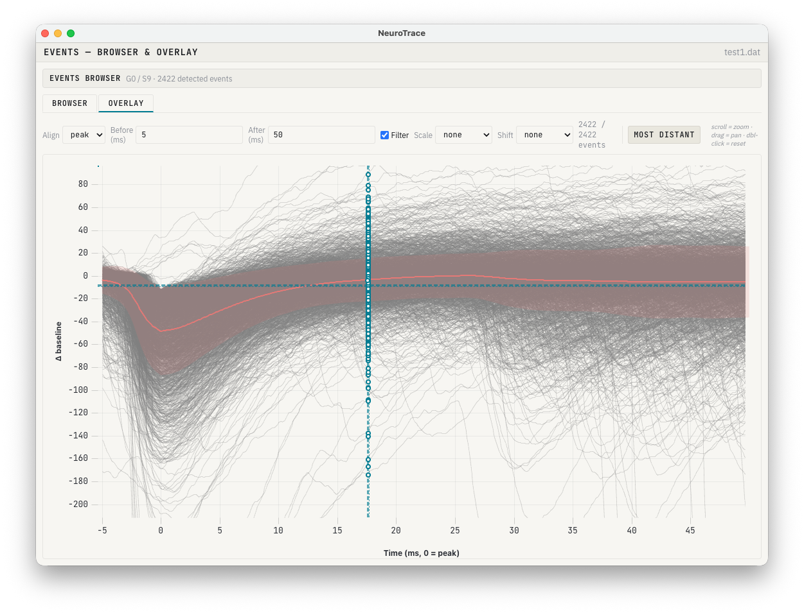

### The Template Generator

The **Template Generator** is for building a recording-specific
biexponential template when the default does not fit your data.

- The right pane shows a draggable cursor band on the trace; you
  position it over a clean, representative event.
- The left pane carries the **library selector** (templates are
  saved by name and re-usable across recordings), a **coefficient
  stepper** for *b₀*, *b₁*, *τ_rise*, *τ_decay*, and the template's
  **width** (each with a slider plus ± buttons), and a **Fit**
  panel: choose direction (auto / positive / negative), optionally
  pre-filter, then **Fit biexponential** runs the fitter on the
  cursor region and reports the resulting *R²*.
- The black template curve overlays the trace live as you adjust
  coefficients, so you can see immediately how well the model
  matches.
- **Save as new** creates a named entry in the library; **Apply to
  existing** updates the active template; **Delete current**
  removes one from the library.

The library lives in the recording's sidecar so templates persist
across sessions.

### The Template Refinement window

The **Template Refinement** window does what the Generator does
manually, but starting from the events the detector has already
found. On open, it averages every detected event in the active
detection (aligned to peak, foot, or rise half-width — your
choice), fits a biexponential to that average, and offers to
**Apply** the new fit to the current template or **Save as new**.

The right pane shows the average event in red and the fit in
orange; the left pane carries the alignment controls and a
coefficient stepper for fine adjustments.

This is the fastest route to a good template: run a permissive
first pass with the default template, refine against the average
of what came back, re-run with the refined template.

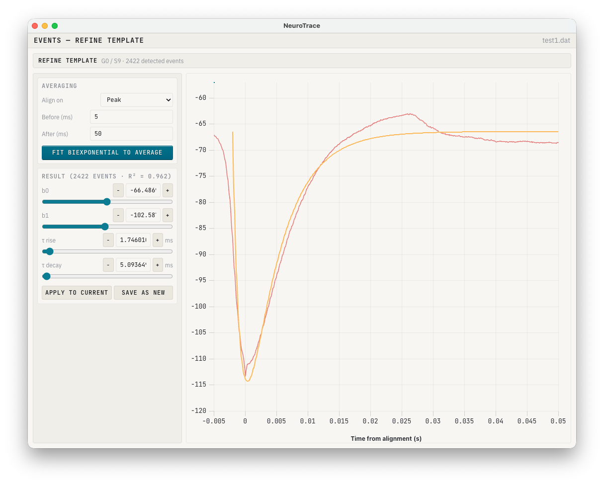

### The detection-measure subplot

When the active detection method is *correlation* or
*deconvolution*, a small auxiliary plot appears below the main
trace showing the signal that the detector actually thresholded.
For correlation, this is the sliding correlation curve; for
deconvolution, the deconvolved amplitude trace plus a horizontal
line at the cutoff. It is the easiest way to tell whether the
chosen cutoff is comfortably above the noise floor or whether
real events sit barely above the line.

### Endpoints

The Events module exposes a fairly large endpoint surface in
`/api/events/*`. The most important are:

- `POST /api/events/detect` — the main detection call, returning
  the full event list with kinetics and the detection-measure
  trace.
- `POST /api/events/detect_stream` — same as above but streamed
  as newline-delimited JSON (`progress` records during the run,
  `result` at the end), which is what the window uses to drive
  the Run-button progress bar.
- `POST /api/events/template_fit` — fits a biexponential to a
  cursor region; used by the Template Generator's *Fit* button.
- `POST /api/events/refine_template` — averages already-detected
  events and fits a biexponential to the average; used by the
  Template Refinement window on open.
- `POST /api/events/add_manual` — measures kinetics on a single
  manually-added event so the result fits into the per-event
  table.
- `POST /api/events/edit_kinetics` — re-measures a single event
  after the user dragged its foot or decay-endpoint marker.

### Persistence

Per-series detection state is stored in the sidecar under an
`events` slot keyed by *(group, series)*: parameters, the events
list (with kinetics and the manual flag), the recorded manual
additions and removals, and the active template. The template
library is also saved in the sidecar.

The Events sub-windows share their view of the recording through
a small *session* slot in Electron preferences (file path,
group, series, channel, sweep, viewport, filter), so opening the
Browser or the Refinement window picks up exactly the same view
the detection window is currently showing.

### Honest gaps

The Events module is the largest in TRACER and a few corners
are still rough. Most visibly:

- The **Histogram** and **Rate** tabs (planned amplitude / IEI /
  decay-τ histograms and a frequency-over-time plot) are
  alluded to in code comments but the data layout for those tabs
  is the responsibility of the main detection window, not the
  Browser, and it has not been documented end-to-end yet. Treat
  the kinetics card and the Overlay tab as the canonical
  per-recording statistics surface for now.
- The detection-window's **Selected** sweep mode is not exposed:
  use the bounds inputs to limit the analysis instead.

---

## 14. Burst Detection (Field Bursts)

The **Burst Detection** window — sometimes called *Field Bursts* —
is for continuous recordings where the question is *when did the
cell or the slice fire a burst* and *how big was it*. It runs
three different detection methods over the recording, returns a
list of bursts with per-burst measurements (amplitude, duration,
rise / decay times, integrated charge, intra-burst frequency),
and lets you curate that list by hand.

The "field" in the name reflects the input signal — extracellular
local-field-potential traces, which is the most common application
— but the same detectors work on intracellular continuous
recordings if your question is burst-shaped rather than
spike-shaped. For individual action potentials in the same
recording, use chapter 12; this chapter is about *envelope-scale*
events.

*Reach this window from the toolbar's **Analyses ▾** menu, or
press `⌘K` and type **bursts** (or **field**, **epi**).*

### When to use this window

- Detecting epileptiform discharges or interictal bursts in a
  long extracellular field-potential recording.
- Counting bursts in a network-oscillation experiment and
  measuring intra-burst frequency.
- Quantifying area / amplitude of recurring evoked responses
  whose timing is irregular.
- Building a per-sweep burst count for a quick survey of a
  recording before deciding what to analyse in detail.

### Window layout

The top bar carries group, series, channel, and sweep-preview
selectors. The body is a left / right split.

The **left panel** holds the parameters: a **Method** dropdown,
a **Baseline mode** dropdown, the method-specific parameters
form (which redraws when you change methods), the pre-detection
filter, and the run controls — pinned to the bottom — with a
**Run** button, a **Sweeps** dropdown (All / Single sweep), and
**Clear** plus **Export CSV** buttons. An error banner appears
above the run controls when a run fails.

The **right panel** is the central viewer plus the results table.
Above the table, a small summary strip reports the burst count,
the estimated baseline and threshold, and a few signal
diagnostics — useful when "no bursts detected" needs explaining.

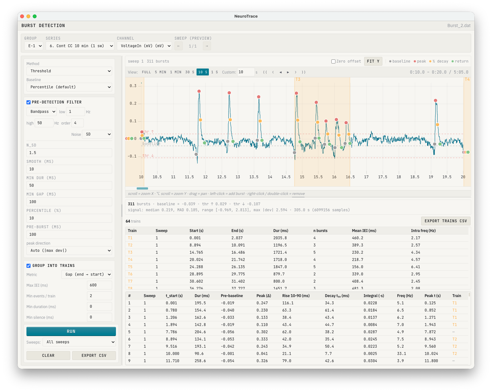

### The continuous-mode viewer

Unlike the other analysis windows, the Burst Detection window's
viewer treats every sweep as a continuous trace and gives you
explicit viewport controls instead of fitting the whole sweep
into the visible area.

A **viewport bar** above the viewer carries six chevron buttons —
`⟨⟨` to the start, `⟪` two viewport widths back, `◀` one width
back, `▶` one forward, `⟫` two forward, `⟩⟩` to the end — plus
a row of **viewport presets**: *Full*, *5 min*, *1 min*, *30 s*,
*10 s*, *1 s*, and a *Custom* numeric input for any value in
seconds. The displayed time range is shown as a caption.

A draggable **scroll indicator** below the viewer mirrors the
viewport position over the full sweep duration: drag it to pan
quickly, or click anywhere on its track to jump there.

Keyboard shortcuts work when the viewer has focus:

| Key | Action |
|---|---|
| `←` / `→` | Scroll one viewport width |
| `PgUp` / `PgDn` | Scroll three viewport widths |
| `Home` / `End` | Jump to the start / end of the sweep |

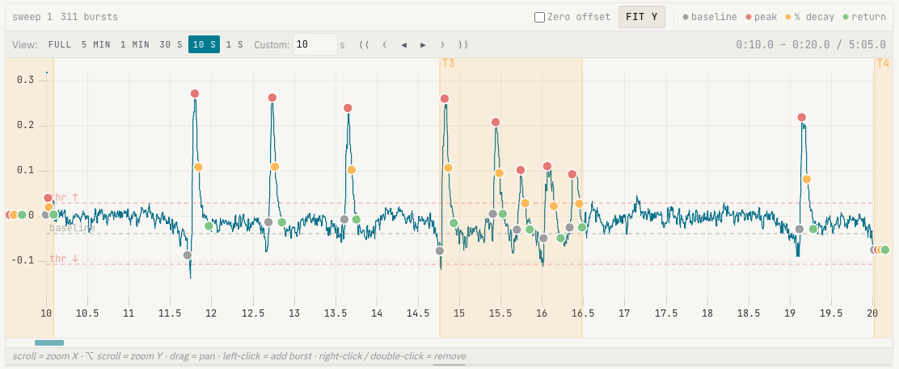

### The pre-detection filter

A filter section in the parameter panel exposes the same
zero-phase Butterworth shape as elsewhere, with one important
default: for the **Threshold** and **ISI** methods the filter is
**on by default** with a 1–50 Hz bandpass, since field-potential
recordings invariably benefit from one. The **Oscillation**
method turns it off by default because it builds its own bandpass
into the algorithm.

The amplitudes reported in the results table are measured on the
*filtered* signal, so the markers drawn over the trace align with
the displayed waveform.

### The noise estimator

Three options for how the per-sweep noise level is computed:

- **`sd`** — the standard deviation of the entire signal. Tight
  estimates after a bandpass filter but inflated by the bursts
  themselves on raw data.
- **`mad`** — *1.4826 × median(|x − median(x)|)*. Robust to
  outliers; the right default for unfiltered or sparsely-bursting
  data.
- **`mad_diff`** — MAD of the first differences, scaled. Robust to
  outliers *and* to slow drift, at the cost of being more
  sensitive to high-frequency noise.

The `1.4826` factor is the constant that makes MAD a consistent
estimator of σ for Gaussian noise.

### The baseline mode

The baseline mode picks how the running baseline of each sweep is
computed — the level from which the detection threshold is offset.

- **`percentile`** (default) — the *N*th percentile of the sweep
  (10 % by default) is taken as the baseline. Robust to long
  drifting traces because percentiles are insensitive to the
  bursts.
- **`robust`** — the median of the sweep. Right when the
  recording is symmetric around its rest level.
- **`rolling`** — a rolling-window median (window length user-set
  in seconds, default 5 s) is computed and *subtracted* from the
  signal; the threshold is then applied to the detrended trace.
  Use this when the recording has slow drift you cannot bandpass
  away.
- **`fixed_start`** — legacy: the baseline is the mean of the
  first portion of the sweep.

The ISI method always uses the percentile baseline; the dropdown
is hidden when ISI is selected.

### Method 1 — Threshold

The straightforward detector: rectify the signal around the
baseline, smooth, and threshold above *baseline + n_sd · noise*.
Parameters:

- **`n_sd`** (default 2.0) — multiplier on the noise level to
  define the threshold.
- **Smooth (ms)** (default 10) — width of the uniform smoothing
  applied to the rectified signal before thresholding.
- **Min duration (ms)** (default 50) — drop epochs shorter than
  this.
- **Min gap (ms)** (default 100) — merge bursts separated by
  less than this.
- **Peak direction** (`auto` / `positive` / `negative`) — sign of
  the deviation that counts as a burst.

The right default for clean field-potential bursts after a
bandpass filter.

### Method 2 — Oscillation envelope

For oscillatory bursts (theta or gamma packets), the envelope
itself is what bursts: the algorithm bandpasses the trace
(default 4–30 Hz), takes the analytic envelope via the Hilbert
transform, smooths the envelope, and applies the same
threshold-on-envelope logic as the Threshold method. Each burst
also gets two extra columns reporting the **mean power** and
**peak power** of the envelope inside it.

Parameters:

- **Low Hz / High Hz** (default 4 / 30) — the bandpass edges
  defining the oscillation band.
- **`n_sd`** (default 2.0).
- **Smooth (ms)** (default 50) — envelope smoothing.
- **Min duration (ms)** (default 100), **Min gap (ms)** (default
  200) — same role as in the Threshold method.

Use this when you are interested in oscillatory packets at a
specific frequency band rather than amplitude excursions in
general.

### Method 3 — ISI

A spike-clustering detector for recordings where individual
discharges are visible: find peaks above an amplitude threshold
(auto-set to 4 × MAD by default, or a user value), then group
them into bursts whenever the inter-spike interval drops below a
ceiling.

Parameters:

- **Spike threshold** (default 0 = auto) — set explicitly if you
  want to override the automatic value.
- **Min spike distance (ms)** (default 2) — refractory period
  fed to `find_peaks`.
- **Max ISI (ms)** (default 100) — group spikes whose ISI is at
  most this; longer gaps end a cluster.
- **Min spikes per burst** (default 3) — clusters with fewer
  spikes are dropped.

The reported burst frequency is computed from the mean ISI
inside the cluster (`1000 / mean_isi_ms`), which is a more
faithful number than the peak-counting heuristic the other
methods use.

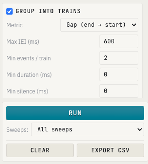

### Burst window extension

After detection, each burst's window is **extended outward** until
the signal returns near its pre-burst baseline. The extension
algorithm walks back from the start until `|signal − baseline|`
falls below a fixed *tail fraction* (10 %) of the burst's peak
deviation, and stops if it would cross into the previous burst's
window or runs more than 500 ms outward. The same is done at
the end. All per-burst measurements (amplitude, duration, rise,
decay, integral, frequency) are then reported on the *extended*
window, not on the original detector output, which is why the
duration column will sometimes be longer than what the threshold
crossings alone suggest.

### Per-burst measurements

The results table has one row per burst:

| Column | Meaning |
|---|---|
| **#** | Burst index, 1-based; `*` prefix marks manually-added bursts |
| **Sweep** | Sweep index |
| **t_start (s)** | Burst onset in seconds |
| **Dur (ms)** | Duration of the *extended* window |
| **Pre-baseline** | Mean signal in a small window before (or after, if no room) the burst |
| **Peak (Δ)** | Maximum |signal − pre_baseline| over the burst |
| **Rise 10–90 (ms)** | Time from 10 % to 90 % of peak amplitude on the rising side |
| **Decay t₅₀ (ms)** | Time from peak to 50 % of peak on the falling side |
| **Integral (·s)** | Trapezoidal integral of |signal − pre_baseline| over the burst, in *units · s* |
| **Freq (Hz)** | Intra-burst frequency: count of prominent local maxima divided by duration; for the ISI method, replaced by the spike-rate-based estimate |
| **Peak t (s)** | Absolute time of the peak sample |

Click a row to jump the viewer to that burst with about a
second of context on either side.

### Run controls and manual edits

The **Sweeps** dropdown offers two modes: **All sweeps** (every
sweep in the series, minus exclusions) and **Single sweep** (one
sweep, by index). A *Range* mode is not currently provided; use
the main viewer's exclusion mechanism if you need to skip
specific sweeps.

Manual editing on the viewer follows the same prime-and-confirm
gesture as elsewhere:

- **Left-click** on the trace adds a burst at the click time. The
  backend re-runs the per-burst measurement on a small window
  around the click, so the row that lands in the table has the
  same kinetics as if the detector had picked it up itself.
- **Left-click on a burst marker** primes it for removal; click
  the same marker again to confirm.

Bursts you have added or kept by hand carry a `manual` flag, are
prefixed with `*` in the table, and are drawn with an outer ring.

### Persistence

Burst results, the manual-edits set, and the form parameters for
each method are stored per *(group, series)* in the recording's
sidecar. Crucially, **each method's last-used parameters are kept
independently** — switching to *Oscillation*, tuning its
parameters, switching to *Threshold*, and coming back to
*Oscillation* finds the parameters exactly as you left them.

The window's left-panel width and viewer height live in the
global preferences file.

---

## 15. Field Potential (fEPSP / LTP)

The **Field Potential** window measures stimulus-evoked
extracellular field responses — fEPSPs from a Schaffer-collateral
pathway, population spikes from a granule-cell layer, paired-pulse
responses to a twin stimulus. It rolls the three most common
field-potential workflows into one window with a tab strip:
**LTP** time-courses, **I-O** (input-output) intensity curves, and
**PPR** (paired-pulse ratio).

*Reach this window from the toolbar's **Analyses ▾** menu, or
press `⌘K` and type **field** (or **fepsp**, **ltp**, **ppr**).*

### When to use this window

- Following an LTP or LTD experiment in real time, with separate
  baseline and post-induction series and an automatic
  normalisation to baseline mean.
- Building an input-output curve from a series whose stimulus
  intensity steps from sweep to sweep.
- Estimating the paired-pulse ratio from a series of paired
  stimuli at one or several inter-stimulus intervals.

For intracellular synaptic responses, use **Cursor Measurements**
(chapter 9); for spontaneous events, use **Event Detection**
(chapter 13).

### Window layout

The top bar carries group, series, and channel selectors plus —
crucially for LTP — a **secondary series** picker for the
post-induction sweeps. A tab strip below switches between LTP /
I-O / PPR; each tab keeps its own parameters.

The body is a left / right split. The **left panel** holds the
filter, the cursor read-out and **Auto-place** button, the
measurement parameters (method, slope percentages, peak direction,
averaging *N*), the mode-specific extras for the current tab, and
the pinned run controls.

The **right panel** is split horizontally. The top half is the
sweep mini-viewer on the left (with the cursor bands draggable on
the trace) and a smaller mini-viewer on the right that shows the
currently-selected bin's averaged waveform with the detected
points overlaid. The bottom half is the time-course graph and the
results table.

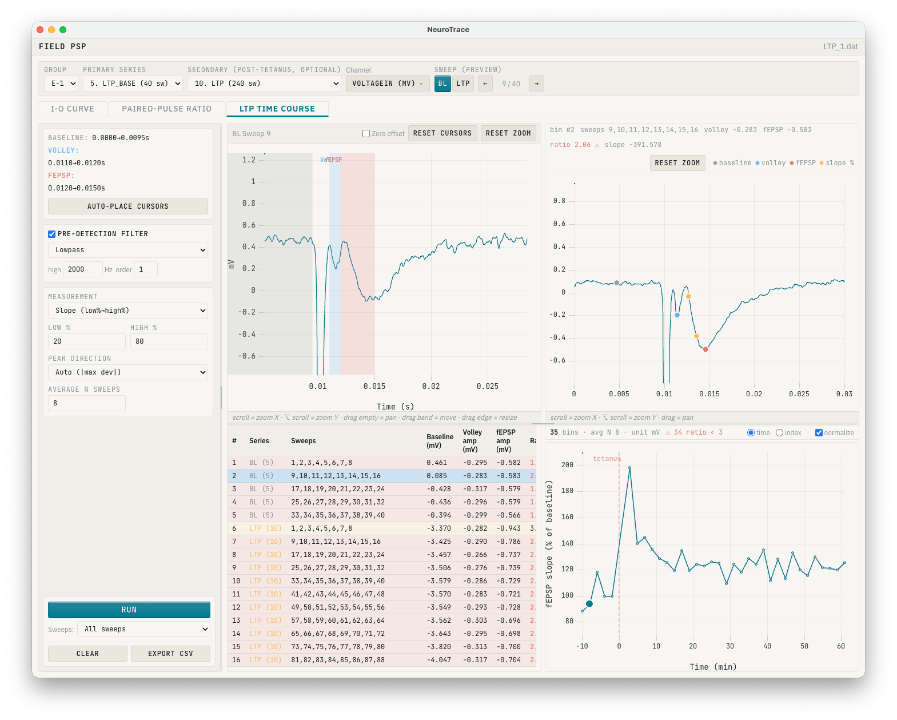

### Cursor windows

Field Potential uses *three* cursor pairs rather than the usual
two, drawn in distinct colours so the role of each is obvious:

| Pair | Colour | Purpose |
|---|---|---|
| **Baseline** | grey | Pre-stimulus window, used for the local DC level |
| **Volley** | blue | Pre-synaptic fibre volley — the fast component immediately after the stimulus artefact |
| **fEPSP** | red | The post-synaptic component, after the volley |

All three are draggable on the mini-viewer (drag a band's edge to
resize, drag the interior to translate). For the PPR tab, two
extra read-only bands — **V2** and **F2** — appear at the
positions set by the *Place V2/F2 from ISI* helper described
below.

### Auto-placing the cursors

The **Auto-place** button uses the recording's `.pgf` protocol
file to find the stimulus onset, then positions the three windows
at conventional defaults: baseline up to 0.5 ms before the
stimulus, volley from 1 ms to 2 ms after, fEPSP from 2 ms to 5
ms after. It is intended as a starting point — the windows are
draggable so you can tighten them around the actual response.

### Measurement direction

A small dropdown picks how the *peak* of each window is
identified.

- **auto** — most-deviated sample relative to the local baseline.
- **negative** — minimum sample. Right for downward extracellular
  fEPSPs.
- **positive** — maximum sample. For inverted recording
  configurations.

### The pre-detection filter

The same Butterworth filter as elsewhere, with the field-
potential default of a *2 kHz lowpass at order 1* — gentle, just
enough to clean high-frequency noise without ringing the volley's
fast flank. Per-sweep filter → average → measure ordering ensures
sweep-to-sweep noise still cancels in the average.

### The fEPSP slope algorithm

For the slope-based methods, the algorithm runs as follows on
each (averaged) sweep:

1. Find the **trough** inside the fEPSP window — the most negative
   sample for a downward response.
2. Estimate a **local baseline** from the first ~2 ms of the
   fEPSP window.
3. Compute the response **amplitude** as *trough − baseline*.
4. **Walk backward from the trough** until the trace crosses
   *baseline + 10 % of amplitude*; **walk forward from there**
   until the trace crosses *baseline + 90 %*. The 10 % and 90 %
   percentages are user-configurable as **Slope low / high %**.
5. **Linear-regress** the samples between those two crossings on a
   millisecond time axis. The reported slope is in *units / ms*
   with an *R²* of fit.

For the **amplitude** method, only the trough and amplitude are
reported. For the **range_slope** method, the slope is fitted with
the user-configurable percentages above. **full_slope** is a
synonym for the default 10–90 %.

### LTP-mode specifics

In LTP mode, the workflow is to pick a baseline series as the
primary series and a post-induction series as the secondary. Two
extra controls then become relevant:

- **Average N** — the number of consecutive sweeps that are
  averaged to make each time-course point. Standard practice is
  *N = 4* on a one-per-fifteen-seconds protocol so each point
  represents a minute of recording.
- **Normalise** — when on, every fEPSP value is divided by the
  mean of the baseline series and reported in percent. The
  time-course graph then shows a flat 100 % line during the
  baseline and the LTP / LTD response above or below it.

The **time-axis mode** picks between *minutes from the series
start* (when the recording's sweep interval is known) and *bin
index*. The two series are joined on a common axis, with
post-induction time at *t > 0* and baseline at *t < 0*.

A small **flagged ratio** column on the table marks bins whose
fEPSP-to-volley ratio falls below 3.0 — a convention for "the
fEPSP is no longer comfortably bigger than the volley", which is
typically a sign of fibre fatigue or electrode drift. Flagged rows
are tinted red.

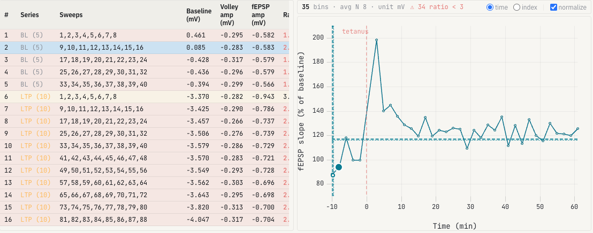

### I-O mode specifics

The I-O tab plots stimulus intensity against fEPSP slope or
amplitude. The intensity per sweep is reconstructed from two
fields you supply:

- **Initial intensity (µA)** — the intensity of the first sweep.
- **Step (µA)** — the increment per sweep.

Sweep *n* is then assumed to carry an intensity of *initial +
n × step* (zero-based). Excluded sweeps are skipped in the count.
Average-N is forced to 1 in this mode — every sweep contributes
its own point.

The result panel is a scatter of intensity against the chosen
*Y metric* (slope or amplitude); a small toggle on the panel
header switches the metric without re-running.

### PPR mode specifics

The PPR tab needs a *second* response window — V2 and F2 — within
the same sweep. The simplest way to set it up is the **Place V2/F2
from ISI** helper: type the inter-stimulus interval in
milliseconds and click the button to copy V1 / F1 forward by the
ISI to V2 / F2.

For each sweep the analysis measures both responses on a chosen
**metric** (amplitude or slope) and reports the ratio
*|val₂ / val₁|*; the *facilitation* flag is set when the ratio
exceeds 1.

The V2 and F2 bands are currently read-only (positioned by the
ISI helper); inline drag-to-edit on the mini-viewer is a planned
follow-up.

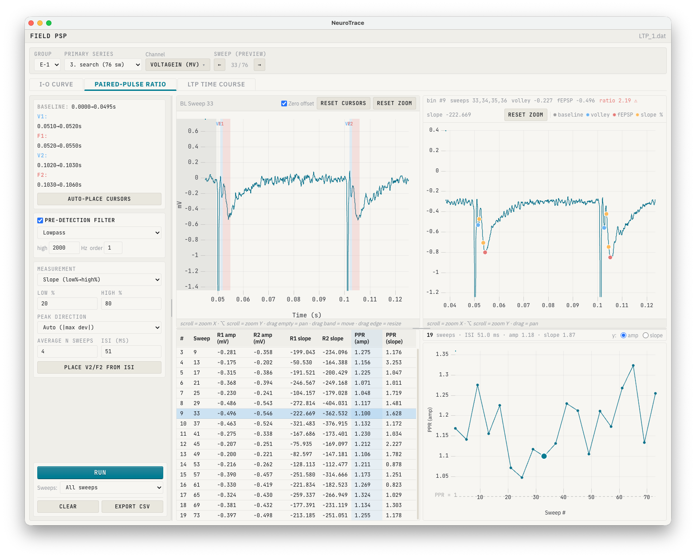

### Results table

The LTP-mode table has columns:

| Column | Meaning |
|---|---|
| **#** | Bin index, 1-based |
| **Series** | *BL (S1)* or *LTP (S2)* — coloured to match the time-course graph |
| **Sweeps** | Comma-separated 1-based sweep indices contributing to this bin |
| **Baseline** | Local baseline value |
| **Volley amp** | Volley amplitude |
| **fEPSP amp** | fEPSP amplitude |
| **Ratio** | fEPSP / volley — flagged red if below 3 |
| **Slope / Amp** | The chosen Y metric |

Click a row to load that bin's averaged waveform into the small
right-side mini-viewer with all the detected points highlighted.
Right-click for *Copy as TSV*; shift-click to multi-select; Cmd-C
to copy.

### Run controls

The dropdown at the bottom of the left panel offers **All sweeps**,
**Range** (with from / to inputs), and **Single sweep** modes. The
**Run** button executes; **Clear** removes the entry for the
current *(group, series, mode)* triple; **Export CSV** writes
every analysed bin across every analysed series to a single CSV.

### Persistence

Results are stored per *(group, series, mode)* triple — that is,
an LTP analysis on series 0 and an I-O analysis on the same series
have independent slots in the sidecar and do not collide. The
form parameters, the cursor windows, the filter state, the time-
axis mode, the normalisation flag, and the currently-selected bin
all persist with the analysis.

---

## 16. Paired Recording

The **Paired Recording** window analyses dual-channel recordings
where one channel triggers an event — an action potential, an
electrical stimulus artefact, a TTL pulse, or a manually-marked
time — and a second channel records the response. For each
trigger event it measures the response amplitude, classifies it
as a success or a failure, fits per-trial kinetics, and rolls the
result up into release statistics: failure rate, potency,
coefficient of variation, paired-pulse ratio, and a
spike-triggered average of the post-channel.

This is the workhorse window for **pre / post synaptic recordings**
— two cells patched simultaneously, one fired into an evoked
response in the other — and for **minimal-stimulation** experiments
where each stimulus produces either a unitary response or a
failure, and the question is what fraction of trials succeed.

*Reach this window from the toolbar's **Analyses ▾** menu, or
press `⌘K` and type **paired** (or **pre**, **post**, **PPR**).*

### When to use this window

- Measuring unitary EPSC / IPSC amplitudes from a paired
  recording, with a clean separation of successes from failures.
- Estimating release probability and CV from minimal-stimulation
  experiments.
- Computing paired-pulse ratios on a multi-pulse protocol where
  each sweep contains two or more triggers.
- Building a spike-triggered average to see the typical post-
  channel response shape, including how it differs between
  successes and failures.

### Window layout

The top bar carries Group, Series, and two channel pickers:
**Pre** and **Post**. The two must be different channels with
the same sampling rate; if they are not, a red banner appears
under the run controls and the analysis refuses to run.

The body is a left / right split with the parameters on the left
in a column of cards, and on the right a horizontal split between
an **overlay viewer** at the top and a **results tab strip** at
the bottom.

The overlay viewer is the distinguishing feature of this window.
It draws the **pre channel on the left axis** and the **post
channel on the right axis**, on a shared X axis, so you can see
each detected trigger and the corresponding post-channel response
side by side without flipping windows. Pre-event markers are
drawn as dots on the pre trace, post-peak markers are drawn on
the post trace (green for successes, pink for failures), and two
draggable cursor bands delimit the post-search window so you can
clip out late artefacts.

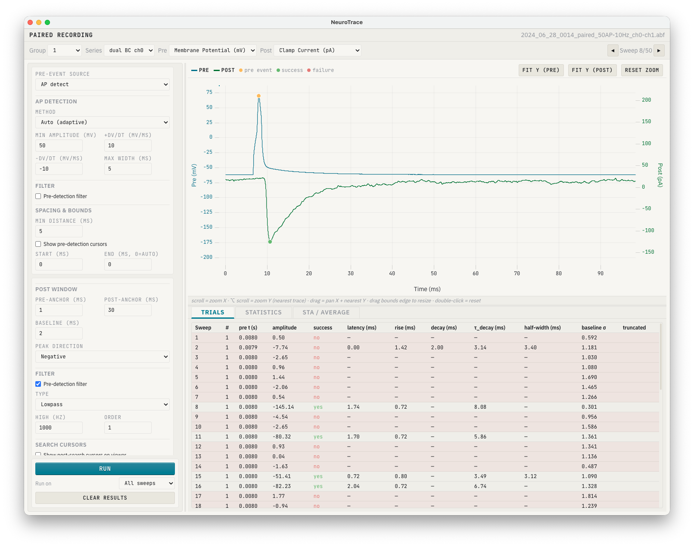

### Selectors and channel choice

- **Group / Series** — standard.
- **Pre** — the channel whose events trigger the analysis.
- **Post** — the channel whose response is measured.

The two cannot be the same channel. The sampling rates must
match; if a recording has two channels at different rates, the
window will report the conflict and skip the run.

### The detection mode

The **Pre-detection mode** dropdown picks how the trigger events
are found on the pre channel. Four modes are offered.

- **AP** — the same spike detector used by the Action Potentials
  window (chapter 12), with the same parameters: method
  (`auto_spike` / `auto_rec`), minimum amplitude, ±dV/dt
  thresholds, max width, manual threshold for the manual
  variant. Use this when the pre channel is in current clamp and
  fires spikes.
- **Stim** — detects electrical-stimulus artefacts as peaks on
  the absolute first derivative `|d/dt|`, with a debounce
  distance to avoid double-counting. Use this when the pre
  channel is the stimulus monitor.
- **TTL** — a level-threshold edge detector (rising / falling /
  both) with a minimum pulse width. Use this when the pre channel
  carries the digital trigger directly.
- **Manual** — no automatic detection; only events you place by
  hand are used.

A common pre-detection filter (the same Butterworth shape as
elsewhere) is applied to the pre channel before detection, with
its own enable toggle and parameters.

### The post window

A handful of inputs control how each post-channel response is
measured.

- **preMs** (default 1.0) — how far back from each trigger time
  the baseline window extends.
- **baselineMs** (default 2.0) — width of the baseline window.
  The baseline is the mean signal in *[t_pre − preMs −
  baselineMs, t_pre − preMs]*, and the per-trial baseline σ is
  also measured here.
- **postMs** (default 30) — the post-trigger search horizon for
  the peak. The window is clipped by the next trigger (with a
  0.2 ms guard) and by the post-search bounds dragged on the
  viewer.
- **peakDirection** — `auto` / `positive` / `negative`.

A separate post filter (default lowpass at 1 kHz, order 1) is
applied to the post channel before measurement.

### The success / failure rule

Each trial is classified as a success or a failure by the
**Failure rule** card. Two modes:

- **`k_sd`** — success when *|peak − baseline| ≥ k · σ*, where σ
  is the per-trial baseline standard deviation. Default *k* is
  3.0.
- **`absolute`** — success when *|amplitude| ≥ A*, with *A* in
  the post channel's units. Default *A* is 0.

The latency rule has two modes too:

- **`fraction`** — the latency is the first time the response
  crosses *fraction · |peak|* away from the baseline, in
  milliseconds relative to the trigger. Default fraction is 0.20
  (20 %).
- **`onset_d2`** — the latency is the time of the maximum of the
  second derivative *d²V/dt²* over the post search window.

Both rules are evaluated only on successes; failures get a blank
in the latency column.

### The trial table

The **Trials** tab carries one row per detected trigger:

| Column | Meaning |
|---|---|
| **Sweep / #** | Sweep index, then trial index within the sweep (manual edits prefixed `*`) |
| **pre t (s)** | Trigger time |
| **amplitude** | Post-channel amplitude (signed) |
| **success** | yes / no, colour-coded |
| **latency (ms)** | Per the latency rule |
| **rise (ms)** | 10–90 % rise on the post response |
| **decay (ms)** | 10–90 % decay |
| **τ_decay (ms)** | Monoexponential decay τ |
| **half-width (ms)** | FWHM |
| **baseline σ** | Per-trial baseline standard deviation |
| **truncated** | True when the post window was clipped by the next trigger |

Failures are tinted red; right-click for *Copy as TSV*,
shift-click to multi-select, Cmd-C to copy.

### The Statistics tab

The **Statistics** tab shows three panels.

The **Series summary** card carries:

- *n_trials*, *n_success*, *n_failures*, *failure_rate*
- *mean amplitude* over all trials
- *mean amplitude (zeroed)* — the same average with failures set
  to zero amplitude (the natural quantity for release probability
  × quantal size)
- *potency* — mean of successes only
- *CV* of successes and *1/CV²*
- *latency mean / SD*

The **PPR table** lists, for every pulse *n ≥ 2*, the ratio
*pulse_n / pulse_1*, computed only on sweeps where pulse 1 was a
success.

The **trial-sequence scatter** below them plots amplitude against
trial index across the entire run; successes appear as blue dots,
failures as red. Run-down, run-up, and bursty failures all have
recognisable signatures here.

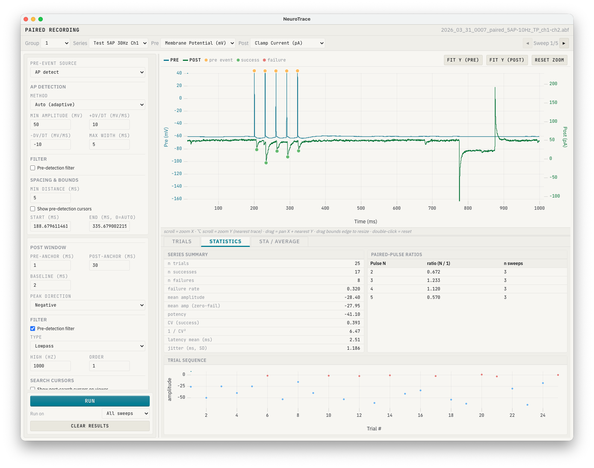

### The STA tab

The **STA** tab is the spike-triggered average: every post
window stacked on a common time axis (zero at the trigger),
averaged with NaN-padding for partial windows, and drawn as a
bold mean curve with a translucent ±1 SEM ribbon around it.

A small header above the plot gives you:

- **Series picker** — *all* / *success* / *failure*. The STA is
  computed independently for each subset, so you can see the
  failure baseline and the success average side by side without
  re-running.
- **Overlay individual trials** — draw every contributing trial
  faintly under the mean.
- **Include failures in overlay** — if the *success* subset is
  active, optionally also draw failures behind the success
  average.
- **Show fit** — fit a monoexponential to the decay phase of the
  averaged trace and overlay it as a dashed line, with τ shown
  in the header.

Right-click the plot for the standard Copy / Save PNG context
menu (this viewer is canvas-based, so vector export is not
offered here — use **Trace Export** for vector figures).

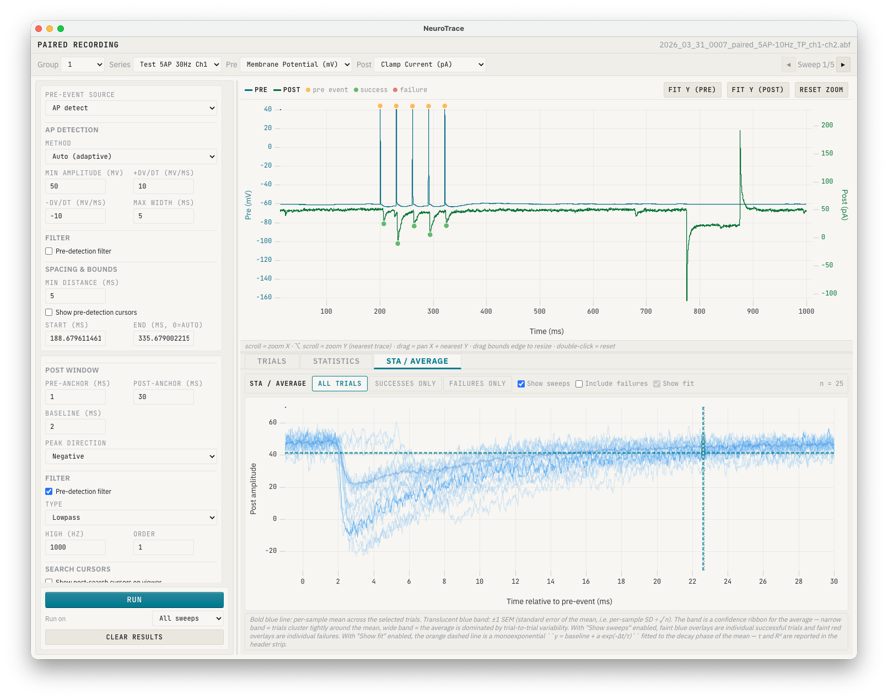

### Run modes and manual editing

The **Run mode** selector at the bottom of the left panel offers
**All sweeps**, **Range**, and **Single sweep**. The **Clear
edits** button discards the manual additions and removals; the
**Run** button executes.

Manual editing is via the prime-and-confirm gesture, but with
two distinct targets:

- **Left-click on the pre trace** adds a manual trigger at the
  click time.
- **Left-click a pre marker** primes it for removal; click again
  to confirm.
- **Left-click a post marker** primes it for marking as a
  manual *failure*; click again to set the manual-failure flag,
  which forces the trial's *success* column to *no* regardless
  of what the *k_sd* / *absolute* rule says.

Manual edits are replayed on every Run.

### Persistence

Paired results are stored in the sidecar under
`analyses.paired[group:series]`, and the form parameters under a
single-shot `forms.paired` slot — Paired uses a single-shot form
state rather than per-series, so opening the window on a different
series picks up the parameters you used most recently rather than
empty defaults. The window's left-panel width and viewer height
live in the global preferences file.

### Cohort integration

Paired is a first-class citizen of the **Cohort** window
(chapter 20). Pick *Paired Recording* on the analysis-type
dropdown and the cohort runner aggregates the per-series release
statistics — failure rate, mean amplitude, potency, CV, 1/CV²,
latency mean / SD, and the paired-pulse ratios — across every
file in the folder. The same export buttons (Excel summary,
Cells wide, Prism `.pzfx`) build per-metric tables ready to plot
or paste.

---

## 17. Metadata

The **Metadata** window is where you tell TRACER what each
recording is. It manages free-form **tags** at two levels —
file-level tags for the recording as a whole, and per-series
tags for individual series within it — plus a recording-level
**cell ID** and **animal ID** and a free-text **notes** field.
Tags drive the **Tree Navigator's** chips, the **Batch** window's
recipe matching, and the **Cohort** window's group definitions:
this is the window where the rest of the application learns what
your data means.

The Metadata window is unusual in two ways. First, it does not
require a recording to be open: it browses the active recording's
folder and lets you tag *any* file in it, opened or not, by
reading and writing each file's `.tracer` sidecar directly.
Second, it offers **batch tagging** across multiple files at
once — useful for an experimental cohort where every cell needs
the same genotype tag.

*Reach this window from the toolbar's **Tags…** button, or press
`⌘K` and type **metadata** (or **tags**).*

### When to use this window

- Tagging a freshly-acquired recording before running its first
  analysis, so the tags are available to Batch and Cohort later.
- Adding a genotype, treatment, or animal-ID tag to every file
  in a cohort folder in one pass.
- Fixing tag typos and case variants across an entire folder
  with the consistency checker.
- Recording free-form notes about a cell (atypical conditions,
  quality concerns) so the next person to look at the file knows.

### Window layout

The window has a top bar, a left pane that lists the files in the
folder, and a right pane that switches between a **single-file
editor** and a **batch editor** depending on what is selected in
the left pane.

The **top bar** shows the active folder and offers **Pick
folder…**, **Refresh**, and **Consistency check** buttons.

The **left pane** is a scrollable file list. Each row carries a
selection checkbox, a coloured **status dot**, the file name
(truncated; full path in tooltip), and a small *open* label if
that file is the currently-open recording. Files without
sidecars are grayed.

The **right pane** is a single-file editor by default and
switches into a batch editor when one or more files are checked
in the left pane.

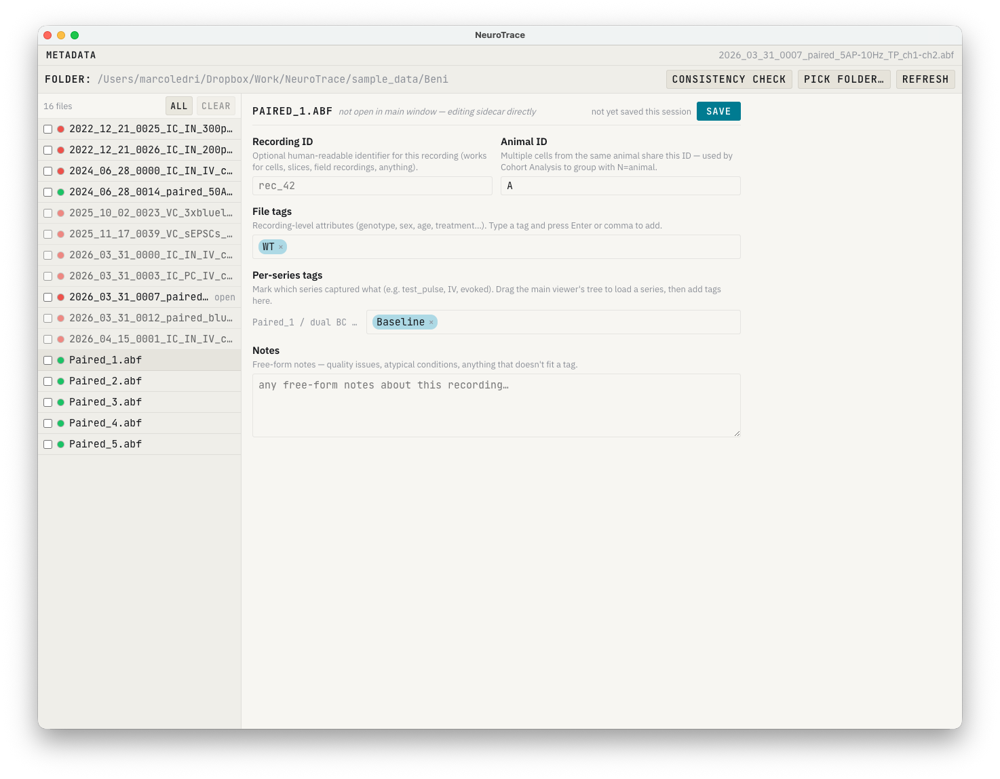

### The status dot

The status dot beside each file gives a quick read on its tagging
state:

- **Red** — no file-level tags yet.
- **Yellow** — file-level tags are set but no series carries any
  series-level tags.
- **Green** — file-level tags set and at least one series is
  tagged.

The same dot appears in the recording header strip at the top of
the main window, so the application's overall "tagging health"
is always visible at a glance.

### The single-file editor

When no files are checked in the left pane, the right side shows
the editor for the file you have clicked on.

- **File header** — file name, *not open* indicator if the file
  is not the active recording, a save-status legend (*Saving…*,
  *Saved · 5s ago*, *Save failed*), and an explicit **Save**
  button.
- **Recording ID** — a free-form human-readable identifier, e.g.
  `rec_42`. Optional; useful when your file names are timestamps.
- **Animal ID** — the cohort identifier shared by every cell from
  the same animal. The Cohort window uses this when **N = animal**
  is selected.
- **File tags** — a chip input with autocomplete drawn from every
  tag already in use across the folder.
- **Per-series tags** — a chip input per series in the recording,
  laid out as a grid. The per-series tags are what Batch matches
  recipes against.
- **Notes** — a four-row free-text field for anything that
  doesn't fit a tag.

Edits write to disk synchronously on every change; the save-status
legend reflects the most recent write.

### The batch editor

Checking one or more files in the left pane swaps the right pane
into a batch editor. Three operations are exposed:

- **Set Animal ID** — overwrite the *animal_id* field on every
  selected file with the value you type. Useful for rolling out
  a freshly-coined cohort identifier.
- **Add file tags** — extend each file's *file tags* with the
  values you supply. Existing tags are preserved.
- **Remove file tags** — strip the supplied tag values from each
  file's *file tags*, case-insensitively.

A progress line below the operation reports *Applying… 3 / 12*
during the run and finalises with a count of files updated and,
if any failed, an error list.

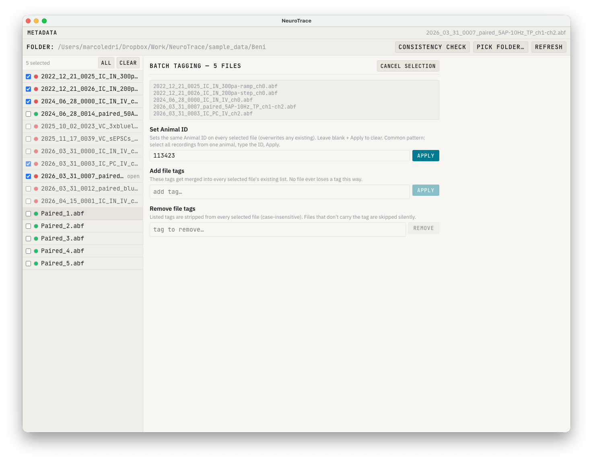

### The consistency checker

The toolbar's **Consistency check** button opens a modal that
scans every sidecar in the folder for near-duplicate tags —
typos, case variants, trailing spaces. Each cluster of variants
is shown together with the per-variant occurrence count and a
*Rename variants → "X"* button that picks one canonical spelling
and rewrites every other variant across the entire folder in one
operation.

### Persistence and cross-window updates

Metadata is stored in each file's `.tracer` sidecar under a
`meta` block, keyed by `cell_id`, `animal_id`, `notes`,
`group_tags`, and `series_tags`. After every write, the metadata
window broadcasts a `meta-update` message; the **Tree Navigator**
listens for it and refreshes its series tag chips live, the
**Recording header strip** updates its status dot, and the
toast that prompts you to add tags to a freshly-opened, untagged
recording is dismissed automatically when you bring the file's
status to green.

### Honest gaps

- There is no fixed tag vocabulary or suggested ontology; tags
  are free-form. The consistency checker helps after the fact,
  not during entry.
- There is no full-text search across files by tag value — you
  filter visually in the left pane.
- Tags carry no provenance (no "added by", no edit history).
- Per-channel metadata (custom unit overrides, channel notes)
  lives elsewhere — see the *Scaling* dialog in chapter 2.

---

## 18. Trace Export

The **Trace Export** window builds publication-ready figures from
ephys traces. Pick one or more sweeps from one or more recordings,
arrange them on a figure with axes / scalebars / legends, tweak
their colours, line weights, baselines, and filters, and export
the result as SVG, PDF, or PNG.

It is the right place to assemble the figure that goes in the
manuscript: cross-recording, vector-clean, with a live preview
that matches the export pixel-for-pixel.

*Reach this window from the toolbar's **Export Traces…** button,
or press `⌘K` and type **export** (or **figure**).*

### When to use this window

- Drawing the first panel of a results figure: one sweep from
  the control condition, one from the drug condition, both
  baseline-subtracted and on the same scalebar.
- Stacking three time-locked traces from three different
  recordings to compare kinetics.
- Mocking up a conference-poster trace at exactly the right size
  in centimetres.

For per-trial scatterplots and histograms, use the cohort window
or copy a results table into Prism / GraphPad.

### Window layout

The window has three resizable vertical panes plus a toolbar.

- **Left pane** — the **Trace List**, one row per trace item.
  Each row shows a coloured indicator and the trace's source
  (file, group, series, sweep range) and is multi-select-able.
- **Centre pane** — the live **preview**, drawn with the same
  uPlot widget as the main viewer. Wheel and drag work the
  usual way; the zoom you set here is captured at export time
  so the saved figure matches the screen.
- **Right pane** — a tabbed editor: a **Trace** tab when one
  trace is selected (style and processing for that trace), or a
  **Figure** tab for the figure-level controls.

The **toolbar** along the top carries: **+ Add traces…**,
**Reset**, **Open…** and **Save…** (sessions), **Templates ▾**
(figure-style presets), and the accent **Export…** button on the
right.

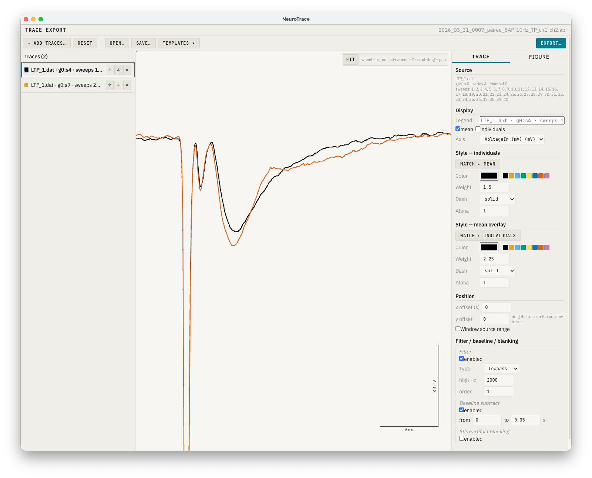

### Adding traces — the source picker

The **+ Add traces…** button opens a modal that lets you walk
the file → group → series → sweeps tree. You can:

- pick the *active* recording or **Add file…** to open another
  recording without leaving the export window;
- expand the chosen file's groups, series, and channels;
- pick sweeps via a **brush grid** (click to toggle), a **range
  text input** (e.g. *1-5, 7, 9*), or **All / None** buttons;
- choose **overlay** mode (every chosen sweep contributes to a
  single trace item with optional mean and individual lines) or
  **separate** mode (each sweep becomes its own item).

You can call the picker as many times as you like; each call adds
new items without disturbing the existing ones, so a figure can
draw on as many recordings as you need.

### The Trace tab

When exactly one item is selected in the list, the right pane
shows the per-trace editor.

**Display** — *legend name* (defaults to a verbose label with the
file and series), *show mean* and *show individuals* checkboxes,
and an *axis* dropdown that assigns the trace to one of the
figure's Y-axes.

**Style** — for the *individuals* lines and the *mean* overlay
independently, set the **colour**, **line weight**, **dash
pattern** (solid / dashed / dotted / dash-dot), and **alpha**. A
**Match ← mean** button propagates the mean style down to the
individuals.

**Offsets** — *Y offset* (in the trace's units) and *X offset*
(in seconds) shift the trace on the figure without modifying the
underlying data.

**Processing** — a **filter** (the same Butterworth shape as
elsewhere), a **baseline subtraction** (mean over a chosen *t₀
→ t₁* window), and a **blanking** range (replace samples in a
chosen window with linearly-interpolated values, useful for
hiding a stimulus artefact). These three are keyed per *(file,
group, series)* — editing them on one trace updates every other
trace from the same series, with a small caption noting how many
items share the change.

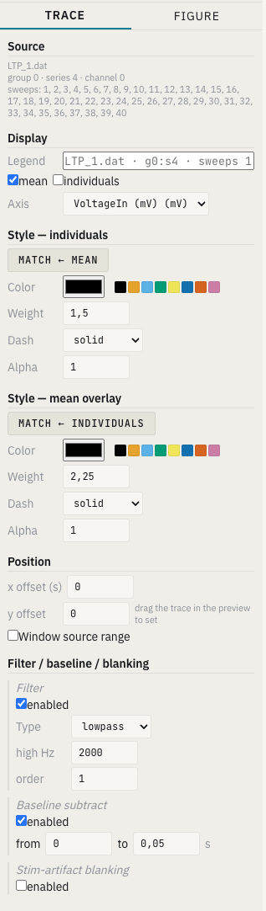

### The Figure tab

The Figure tab governs everything the Trace tab does not.

- **Panel layout** — *overlay* (every Y-axis on a single panel,
  via twinx siblings) or *stacked* (each axis its own subplot,
  shared X axis). Stacked is only meaningful with two or more
  axes.
- **Axis style** — *axes* (traditional spines, ticks, labels)
  or *scalebars* (corner-anchored time and voltage / current
  bars; no spines).
- **Axes** — one card per Y-axis, with label, unit, side
  (left / right / right-offset), height weight (stacked layout),
  and either auto-limits or explicit min / max.
- **Scalebar** — corner, padding, thickness, colour, label
  visibility, font size, override values for time and per-axis
  Y.
- **Legend** — enabled, position, font size, *only_named* (hide
  trace items that did not get an explicit legend name).
- **Figure size** — width and height in centimetres, DPI for the
  raster outputs.

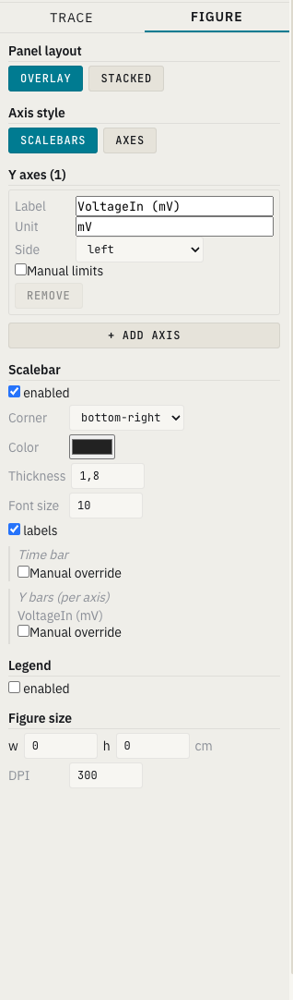

### Templates and sessions

The toolbar's **Templates ▾** menu lets you save the current
figure's *look* — axes, scalebar, legend, axis style, panel
layout, size, DPI — without the trace items themselves, so the
template can be applied to a future figure and styled
consistently. Templates live in the global preferences file.

**Open…** and **Save…** save and reload a complete *session* —
items, processing, and styling — to a `.tracer_figure` JSON
file. Sessions are useful when you need to come back to the same
figure two weeks later and remember exactly which sweeps you
chose.

### Exporting

The accent **Export…** button opens a modal with an inline SVG
preview of the figure as it will be saved. A radio picker chooses
the output format (SVG / PDF / PNG); the **Save** button writes
to a path you pick. The current zoom state of the preview is
captured at the moment you open the export modal, so you can
zoom in on a detail in the preview pane and that view is what
goes to disk.

### Cross-recording

Trace items can come from arbitrary files; the application keeps
an in-memory cache (up to eight recently-opened files) of the
parsed recordings so re-renders are fast. Each item carries an
absolute file path, group, series, and sweep indices; sessions
record the same.

### Honest gaps

- Each trace item carries one channel; to compare two channels
  from the same series, add the series twice with a different
  channel each time.
- Per-sweep style overrides (colour sweep #1 differently from
  sweep #5 within the same item) are not currently exposed.
- The session file's references are absolute paths; if you move
  the recordings later, reopening the session will fail to find
  them.

---

## 19. Batch

The **Batch** window applies a chosen recording's analyses to
every recording in a folder. It is the natural follow-up to the
**Metadata** window: tag a folder of cells consistently, run all
the analyses you want on a single template recording, then point
Batch at the folder and let it replay those analyses across every
file with parameters carried over from the template.

Batch never re-uses *manual* edits — manual spike additions, hand-
edited event kinetics, accepted / rejected bursts. It carries
*parameters* across files and detects fresh on each one. This is
intentional: batch is the right answer when your protocol is
uniform across cells and only the data differs, and curation is
inherently per-cell.

*Reach this window from the toolbar's **Batch…** button, or press
`⌘K` and type **batch**.*

### When to use this window

- Running the same Events / Bursts / AP analyses across a folder
  of similarly-tagged cells, in one go.
- Building a cohort by analysing every recording in a folder
  with parameters tuned on a representative cell first.
- Re-running an entire folder after fixing a mistake in the
  template's parameters.

### How Batch matches files

Batch's matching is **tag-driven**. The template's series-level
tags are the keys; for each tag the template carries a recipe
(an analysis type plus its parameters) that any *other* file's
series carrying the same tag will be run with. So:

1. You tag the template recording's series in the Metadata
   window — for example, series 1 as `iv`, series 2 as
   `mEPSC`, series 3 as `ltp_baseline`.
2. You run the analyses on the template (Events, I-V, fEPSP-LTP).
3. You point Batch at a folder; for each file, every series
   tagged `iv` gets the I-V recipe, every series tagged `mEPSC`
   gets the Events recipe, and so on.

Untagged series in the template do not contribute recipes, and
files whose series are not tagged with any of the template's
tags are simply skipped.

### Window layout

- **Top bar** — a label *Template:* followed by the template
  file's path and a **Pick template… / Change template…**
  button. By default, the currently-open recording is used as
  the template; pick another with the button if needed.
- **Run bar** — a wide **Run** button (which fills with a
  progress overlay during the run), an indicator of the number
  of tasks selected, and a **Cancel** button while a run is
  active.
- **Recipe list** — a read-only table of the recipes derived
  from the template, grouped by analysis type. Each recipe shows
  which tags it matches against; FPsp LTP recipes that need a
  secondary post-tetanus series show their secondary tag too.
- **Target section** — a **Pick folder…** button; once a folder
  is chosen, a table appears with one row per file and one
  column per recipe. Each cell is either a checkbox (this file
  has a series with the matching tag) or a *no match* note.
- **Conflict panel** — appears in red if a single series matches
  more than one selected recipe. Resolve before running.
- **Run log** — appears below the table once a run has started,
  with one collapsible block per file and a green / red / orange
  per-recipe entry showing success, failure (with the error),
  or skipped (unsupported analysis type).

The table has bulk-select buttons (**All matched**, **None**,
**Reset**) and an **Overwrite existing results** checkbox: by
default, recipes whose results already exist on a target file
are skipped, marked *has results · skip*. Tick the box to
overwrite.

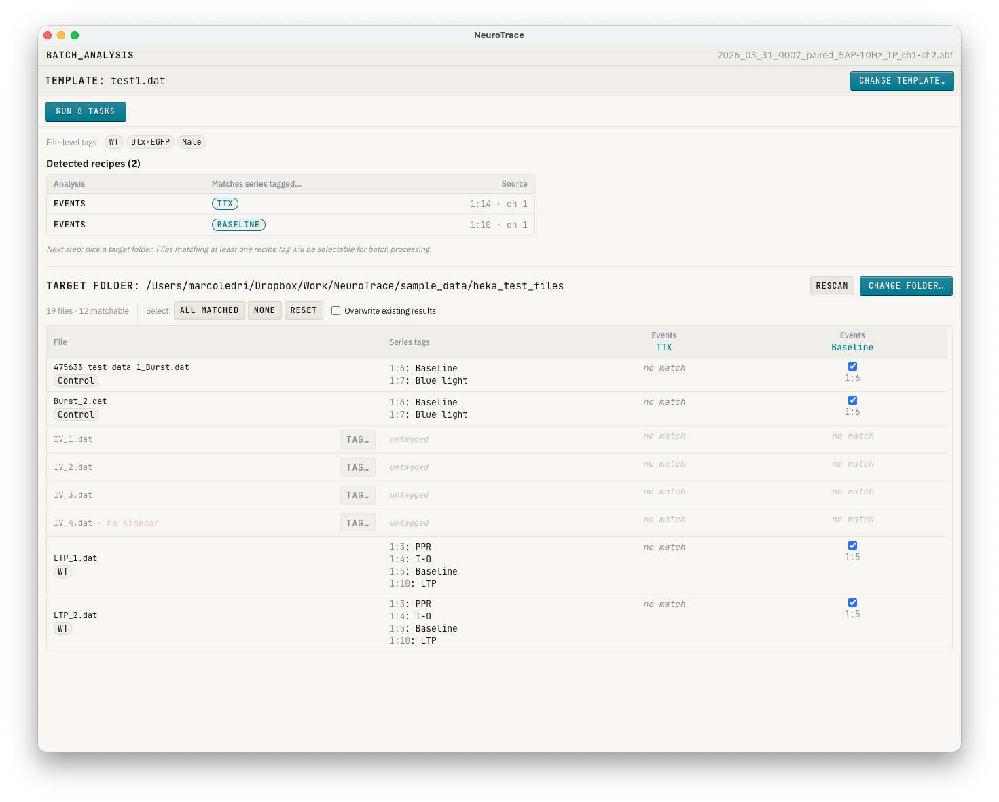

### What recipes Batch supports

Batch can replay these analyses:

- **Cursor Measurements**
- **Resistance**
- **I-V Curve**
- **Action Potentials**
- **Paired Recording**
- **Events**
- **Bursts**
- **Field Potential** (LTP, I-O, PPR)

Each recipe carries the parameters from the template's analysis
plus the channel choice. For Field Potential LTP, the secondary
post-tetanus series is matched on the target file by its tag at
run time.

### The run loop

Clicking **Run** asks for confirmation, then walks the selected
(file, recipe) pairs in order. For each file, Batch closes the
currently-open recording, opens the target file, runs every
selected recipe in turn, writes the results into the target
file's sidecar, and moves on. The progress overlay on the Run
button fills proportionally to total tasks completed; a status
line gives the current file index, file name, and per-file
progress percentage.

The **Cancel** button is a soft cancel: the file currently
running finishes, then the loop exits before opening the next
file.

When the run is finished, the **Run log** shows the per-recipe
status. *Open in Cohort…* at the right of the run bar opens the
Cohort window pointed at the same folder so you can aggregate
the freshly-written results without retyping the path.

### Honest gaps

- Per-file parameter overrides are not currently supported. If
  one file in your folder needs slightly different parameters,
  run it separately or pick a different template.
- Channel re-mapping is not supported. The template's channel
  index is used as-is on every target file; if the target's
  channels are arranged differently, the recipe will detect on
  the wrong channel.
- Mid-file abort is not supported — Cancel waits for the current
  file's recipes to finish.
- Batch does not export a CSV summary. The results land in each
  target's sidecar; use the Cohort window to aggregate them.

---

## 20. Cohort

The **Cohort** window aggregates results across many already-
analysed recordings and turns them into population statistics:
per-group means and SEMs, hypothesis tests, and ready-to-export
tables. It is the last stop in the analysis pipeline — every
file has been opened, tagged, analysed, and saved; Cohort reads
the sidecars and rolls everything up.

It does **not** run analyses itself. Every cell that contributes
to a Cohort result was analysed previously, either by hand in an
analysis window or by the Batch window. Cohort reads the
`.tracer` sidecars and aggregates the values stored there.

*Reach this window from the toolbar's **Cohort…** button, or
press `⌘K` and type **cohort**.*

### When to use this window

- Comparing two or more groups of cells (genotype, treatment,
  brain region) on a chosen scalar metric — mean amplitude,
  firing rate, rheobase, fEPSP slope.
- Comparing within-cell conditions (baseline vs drug) when each
  cell's series carry the right tags.
- Producing a Prism `.pzfx` file ready to plot in GraphPad,
  with one table per metric and one column per group.

### Window layout

The window walks you through five panels in sequence; each
becomes available as the previous one is filled in.

1. **Folder picker** — pick the folder of recordings.
2. **Analysis type** — pick which analysis the comparison is
   about (Events, AP, Resistance, I-V Curve, fEPSP I-O, fEPSP
   PPR, fEPSP LTP, Bursts, Cursors, Paired).
3. **Aggregate** — Cohort reads every `.tracer` sidecar in
   the folder and reports how many cells were found, how many
   were skipped (no tags, no analysis, parse error).
4. **Wizard** — design the comparison: comparison shape
   (between-subjects vs within-subjects), tag selection for
   group definition, *N* unit (cell / series / animal),
   optional series-role filter, parametric / nonparametric
   override.
5. **Metrics + Results** — pick which metrics to test and plot.
   Stats and graphs render in the right pane in three tabs.

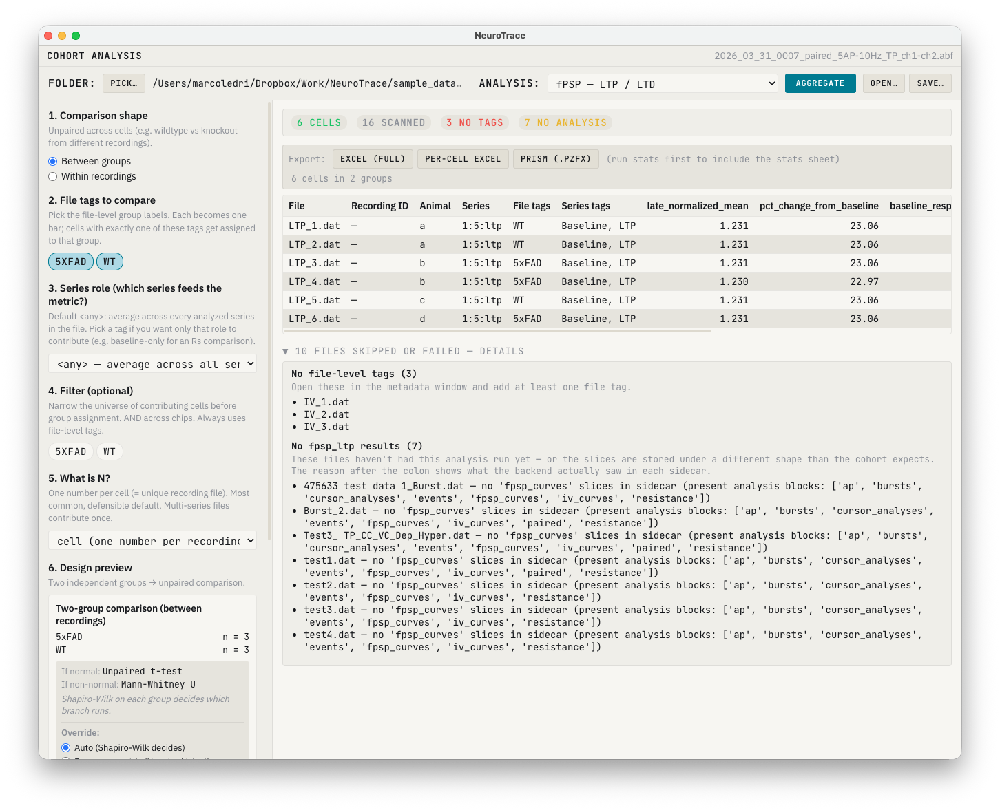

### How groups are defined

Cohort never asks you to drag cells into groups. Group
membership is **derived from tags** the Metadata window has
already attached.

- For a **between-subjects** comparison (e.g. WT vs KO), Cohort
  groups files by their *file-level* tags. Pick the two (or more)
  tags whose populations you want to compare.
- For a **within-subjects** comparison (e.g. baseline vs drug
  measured in the same cell), Cohort groups by *series-level*
  tags within each file, pairing series across the file by tag.

In both cases, you can also collapse rows by **animal** rather
than by cell — handy when the unit of analysis is the animal
rather than the cell — using the *N unit* selector.

### What gets aggregated

Each registered analysis type contributes a set of **scalar
metrics** (mean amplitude, firing rate, rheobase, etc.) and,
where appropriate, **distributions** (every IEI, every event
amplitude per cell) and **timeseries** (the LTP normalised
fEPSP-vs-time trace). The metric tree on the metric-selection
panel groups these and pre-checks a curated default set so a
sensible comparison is one click away.

### Statistics

Stats are run via Pingouin under the hood. The design taxonomy
is fixed:

- **Two independent groups** → Welch's *t* (parametric) or
  Mann-Whitney *U* (nonparametric).
- **Three or more independent groups** → one-way ANOVA + Tukey
  HSD, or Kruskal-Wallis + Dunn.
- **Two paired conditions** → paired *t* or Wilcoxon
  signed-rank.
- **Three or more paired conditions** → repeated-measures ANOVA
  + pairwise *t*, or Friedman + pairwise Wilcoxon.

The parametric / nonparametric branch is chosen automatically
by Shapiro-Wilk when the **Test** override is *auto* (default);
you can force the branch with *parametric* or *nonparametric*.

The stats table reports the test name, statistic, *p*, degrees
of freedom (where defined), effect size (Cohen's *d*, η²,
rank-biserial *r*, etc.), Shapiro-Wilk verdicts per group, and
descriptives (mean, SD, SEM, median, IQR per group).
Multi-group post-hocs are Holm-corrected; **the top-level test
across metrics is not corrected** — apply Bonferroni or
Benjamini-Hochberg yourself when you have many metrics.

### Graphs

Every metric draws a small inline graph next to its stats row;
clicking it opens a fullscreen modal where you can override
axes, group colours, and labels.

- **Scalar metrics** — strip plot of per-cell points per group
  with a central-tendency line (mean or median) and a spread
  whisker (SEM / SD / 95 % CI / IQR / range), with significance
  brackets for p < .05 pairs.
- **Distribution metrics** — per-cell faded ECDFs plus the
  group-mean ECDF in bold. The mean ECDF is computed by
  averaging *per-cell ECDFs*, not by pooling events; this is
  the right approach to avoid pseudoreplication.
- **Timeseries metrics** — per-cell faint traces with a group
  mean ± SEM band, optionally re-zeroed at the LTP induction
  marker.

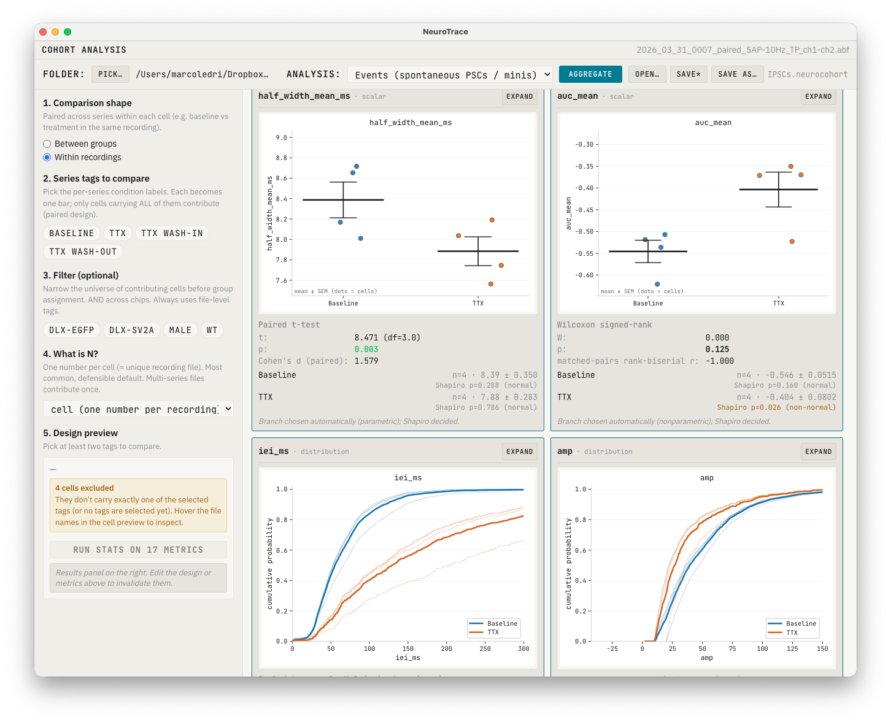

### Export

Three buttons sit at the bottom right.

- **Excel summary** — a multi-sheet `.xlsx` workbook with a
  Cohort summary sheet, a Stats summary sheet, a wide *cells ×
  scalars* table, a long *cell × metric* tidy table, and per-
  distribution-metric sheets.
- **Cells wide** — a lean single-sheet wide table of cells ×
  scalars; right when you want a quick paste into your own
  analysis.
- **Prism .pzfx** — a GraphPad Prism file with one table per
  metric, columns by group, ready to plot. Distribution metrics
  produce three tables each (pooled events, ECDF by group, ECDF
  by cell); timeseries metrics produce two (group mean / SEM
  per bin, plus per-cell traces).

### Sessions

Cohort state — folder, analysis type, comparison shape, tag
selection, metric selection, graph customisations — can be saved
to a `.tracer_cohort` JSON session file via Save / Open. Reopening
the file restores the wizard exactly, recomputes the aggregate,
and shows the same stats and graphs. Sessions are global rather
than per-recording.

### Honest gaps

- There is no automatic correction for multiple testing across
  metrics; only the post-hoc tests within a multi-group design
  are corrected. Mind your *p* counts.
- Auto-save of the session file is not yet implemented; save
  explicitly when you are about to step away from the window.
- Effect-size labels (small / medium / large) are not provided —
  you get the numbers, not the verbal interpretation.

---

## 21. Train Grouping (events, APs, bursts)

**Train Grouping** is a cross-cutting feature shared by the Action
Potentials, Event Detection, and Burst Detection windows. Once a
module has produced a list of detected events, it can optionally
cluster the closely-spaced ones into *trains* — multi-event groups
the user wants to count, measure, and compare separately from
isolated events. Off by default; flip a single sidebar checkbox in
any of the three windows to turn it on.

The grouping is purely post-detection. Toggling it on does **not**
re-run detection: the algorithm walks the existing list of
timestamps, walks consecutive pairs, and labels every cluster
whose inter-event intervals fall under your threshold. Manual
edits — adding or deleting an event with a click — instantly
refresh the train assignments without going back to the backend.

### When to use this

- Identifying *epileptiform clusters*: groups of field bursts that
  fire close together, separated by quiet stretches.
- Picking out *high-frequency AP bursts* inside a long
  current-clamp depolarisation, distinct from the steady tonic
  firing of an adapting cell.
- Detecting *barrages* of synaptic events from a single release
  site or evoked train, separately from the spontaneous baseline.
- Per-cell metrics for cohort comparison: how often does each cell
  produce a train, how many events on average, how high is the
  intra-train frequency.

If the only thing you need is "how often does *anything* fire", the
plain detection numbers are enough. Trains are for the question
*"how often does it fire **a lot at once**?"*

### The sidebar panel

The same `Group into trains` panel appears in all three windows
— it lives below the detection-method controls so it reads as a
post-processing step.

- **Group into trains** — the master checkbox. Off by default; no
  trains are computed and no extra UI shows.
- **Metric** — *Gap (end → start)* or *Peak-to-peak*. Bursts
  default to **Gap** because they are extended events: a long
  burst followed by a long silence shouldn't merge with the next
  burst just because their peaks are close in time. Events and
  APs default to **Peak-to-peak** because they are point events
  and the literature convention is peak-time differences.
- **Max IEI (ms)** — the threshold below which two consecutive
  events count as belonging to the same train. Defaults: bursts
  500 ms, events 50 ms, APs 20 ms.
- **Min events / train** — clusters with fewer than this many
  events are dropped (returned as isolated events). Default 2 for
  bursts, 3 for events and APs.
- **Min duration (ms)** — drop trains shorter than this in total
  span. 0 disables the floor (default).
- **Min silence (ms)** — after the initial pass, two trains
  separated by less than this gap get merged into one. 0 disables
  the merge (default).

A small inline warning appears under the Burst-window panel when
**Max IEI** is set below the detection's own `min_gap_ms` —
adjacent bursts under that threshold are already merged upstream
into a single burst, so they cannot cluster into a train. Raise
**Max IEI** above `min_gap_ms` to make grouping meaningful.

### How the algorithm works

Single forward pass, sweep by sweep. Trains never cross sweep
boundaries — different sweeps are different trials. Within each
sweep, events are sorted by time (defensive against manual edits
landing out of order), then walked pair-by-pair: while consecutive
IEIs stay under **Max IEI**, the train grows; once an IEI exceeds
the threshold the train closes. Candidates shorter than **Min
events / train** or **Min duration** are discarded. Finally, if
**Min silence** is non-zero, a merge sweep glues adjacent trains
whose end-to-start gap falls below it.

Train IDs are global per series (T1, T2, … across all sweeps), so
the on-screen labels match the CSV `train_id` column exactly.

### Visualisation on the trace

When grouping is on, every sweep viewer (Burst, Event, AP) paints
a faint amber band across each train's `[start_s, end_s]` range,
with a small `T#` label at the upper-left corner. The bands sit
*behind* the per-event markers so the markers stay readable. The
amber colour matches the manual-event ring colour throughout the
app — the visual story is *"this is a higher-level grouping of the
events you already see."*

The bands refresh live on every change: enabling the checkbox,
editing **Max IEI**, adding or removing a manual event, switching
sweeps. None of these triggers a re-detection.

### Tables and CSV exports

Each module surfaces the grouping in two places:

- **Per-event table** — gains a `Train` column showing `T1`, `T2`,
  …, or `—` for isolated events. Hidden when grouping is off so
  users without the feature don't see an empty column.
- **Per-train summary** — shown alongside the per-event table.
  Burst window: a compact card directly above the bursts table.
  Event window: a dedicated **Trains** sub-tab next to **Results**.
  AP window: a sub-tab strip in the Counting tab (**Per sweep** /
  **Trains**) that swaps the per-sweep counting table for the
  per-train summary. Each train summary lists `Train | Sweep |
  Start | End | Dur | n events | Mean IEI | Intra freq`.

CSV exports follow the same split:

- The main per-event CSV gains a trailing `train_id` column (1-based,
  blank for isolated events or when grouping is off). The button
  is the same `Export CSV` you already use; nothing about the
  workflow changes.
- A second `Export trains CSV` button writes a per-train summary
  file (`*_event_trains.csv`, `*_burst_trains.csv`,
  `*_ap_trains.csv`) — one row per train, with the IEI / duration
  / frequency stats *plus* the train-detection parameters used
  to derive them. The parameter columns at the right let someone
  reading the CSV later reproduce the train list without your
  sidecar.

### Persistence

Train **parameters** are saved per-recording in the `.tracer`
sidecar under `train_params.<module>[group:series]`. Train
**results** are not saved — they are recomputed from the events
list on demand whenever a window opens, a manual edit happens, or
a cohort scan runs. This keeps the sidecar small and guarantees
the displayed trains and the CSV always agree with the current
event list, even after edits.

If you change a train parameter and don't run anything, the new
value is still saved — the sidecar auto-saves on every form edit
the same way the rest of the analysis windows do.

### Cohort integration

When the cohort module aggregates a folder, each per-cell
extractor (events, AP, bursts) reads `train_params` from that
cell's sidecar and recomputes the trains using the *same*
algorithm the on-screen windows use. Whenever grouping is enabled
on a cell, the extractor adds:

**Scalars** (one number per cell, used for stats and dot-plots):

- `n_trains` — number of trains in the recording.
- `n_events_in_trains` — events that belong to a train (vs
  isolated).
- `fraction_events_in_trains` — `n_events_in_trains / n_total`.
- `train_rate_per_min` — `n_trains / recording_duration_min`.
- `mean_events_per_train` — average cluster size.
- `mean_train_duration_ms` — average train span.
- `mean_intra_train_iei_ms` — average within-train IEI.
- `mean_intra_train_freq_hz` — average within-train frequency.

**Distributions** (per-cell arrays, used for histograms / ECDFs
and per-cell tests):

- `events_per_train` — cluster size for every train.
- `train_durations_ms` — duration of every train.
- `intra_train_iei_ms` — every within-train mean IEI.
- `inter_train_iei_ms` — gap between consecutive trains within
  a sweep.

These appear automatically in the cohort metric picker once a
cell with `train_params.enabled = true` lands in the scan.
Cells with grouping off contribute zero to the train metric
columns, so mixed cohorts (some cells with grouping, some
without) are handled gracefully.

### Batch integration

When you run **Batch** with a template recipe, the template's
`train_params` for each `(group, series)` recipe travel
alongside the analysis params. After the runner finishes the
analysis on each target file, it writes the matching
`train_params` slot to the target's sidecar. End result: every
target inherits the template's grouping parameters, so a
cohort scan over the post-batch folder produces consistent
train metrics across the whole batch — no need to open each
target manually and toggle grouping on.

### Honest gaps

- There is no global `Apply trains everywhere` toggle in the
  Cohort window. To run a single set of train parameters across
  a heterogeneous folder, set them in the template, run Batch
  to propagate, and *then* aggregate.
- The algorithm is sweep-local. There is currently no setting
  that lets a train span sweep boundaries; in long protocols
  with intentional cross-sweep continuity (e.g. concatenating
  short sweeps from one tonic recording) you'd need to edit
  the underlying sweep structure first.
- The default thresholds reflect cortical / hippocampal
  norms — adjust them for your cell type rather than treating
  them as gospel.

---
